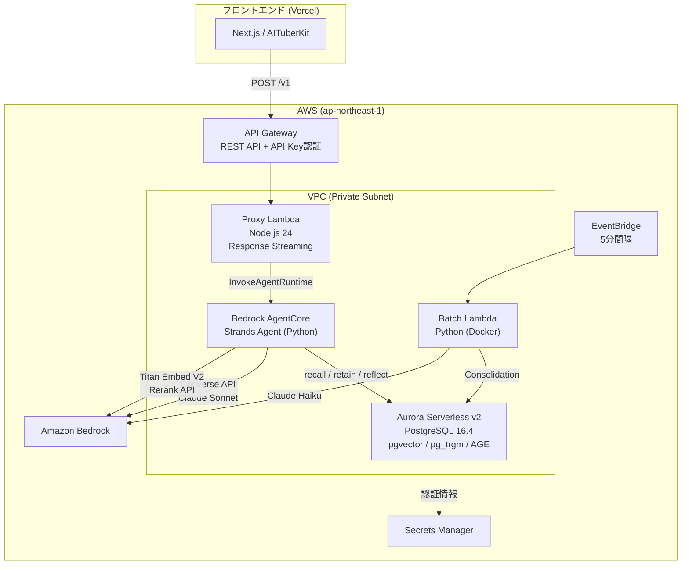

# イメージ
かわいい。


# アーキテクチャ

## システム構成図



# 使用方法

```bash
# DB起動
cd postgresql && docker compose up -d

# AgentCore起動
uv sync
uv run local.py

# バッチ
cd batch
uv run python local.py --interval 60

# フロントエンド
cd front
pnpm run dev

# CDK
pnpm cdk:dev deploy
```

# モデル

- 原則ローカルで使用する予定で外部に露見させない
- 外部で使用する場合は容易に取り出せない状態とする
  - 対象者を絞った限定的な公開
  - Next.jsのミドルウェアで認証設定
  - モデルを暗号化


詳細は下記を参照
docs/設計/フロントエンド/モデル保護.md


https://mk22.booth.pm/items/5007531

# docs

下記参照

- docs/設計
  - AWS
  - フロントエンド
  - 記憶システム

# 記憶システム

- Hindsight
  - https://arxiv.org/pdf/2512.12818

# 実装マイルストーン
[x] 記憶保持、検索

[x] 外見の創造

[x] 知らないことを教えて欲しい

[ ] 感情
- 外的要因による感情の変化
- ユーザーに対する感情変動

[ ] 最終目標:ハッピーエンド
- 現実とのお別れ
