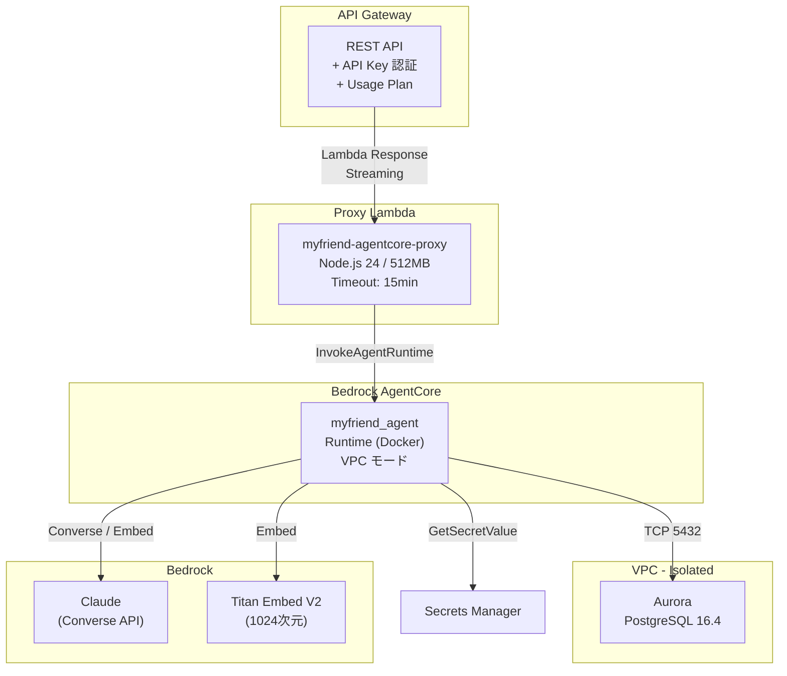
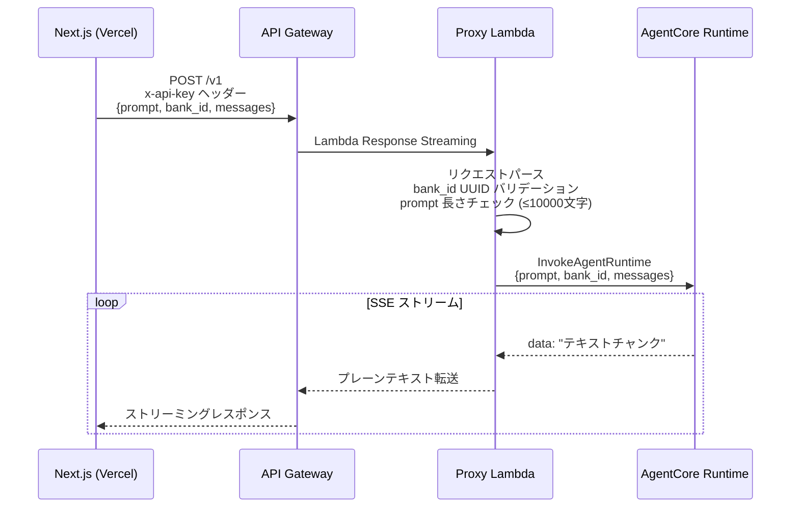

# AgentCore 設計

## 構成

## AgentCore Runtime

| 項目 | 値 |
|---|---|
| Runtime 名 | `myfriend_agent` |
| アーティファクト | `agentcore/Dockerfile` からビルド |
| ネットワーク | VPC モード（Isolated サブネット） |
| 環境変数 | `AWS_REGION`, `DB_SECRET_ARN`, `DB_HOST`, `DB_NAME` |

### IAM 権限

| 権限 | リソース | 用途 |
|---|---|---|
| `bedrock:*` | `*` | Converse API, Embedding, Rerank |
| Secrets Manager Read | DB シークレット | DB 認証情報取得 |

### SG 接続

AgentCore Runtime の SG → Aurora SG へ TCP 5432 を許可。

## Proxy Lambda

| 項目 | 値 |
|---|---|
| 関数名 | `myfriend-agentcore-proxy` |
| ランタイム | Node.js 24 |
| メモリ | 512MB |
| タイムアウト | 15分 |
| 環境変数 | `AGENT_RUNTIME_ARN` |

### 処理フロー

### バリデーション

- `bank_id`: UUID 形式必須
- `prompt`: 必須、文字列型、最大10,000文字
- `sessionId`: 省略時は自動生成（UUID v4）

## API Gateway

| 項目 | 値 |
|---|---|
| API 名 | `MyfriendApi` |
| エンドポイント | Regional |
| ステージ | `v1` |
| 認証 | API Key 必須 |
| ストリーミング | Lambda Response Streaming 対応 |
| 統合タイムアウト | 15分 |

### Usage Plan

| 項目 | 値 |
|---|---|
| レートリミット | 10 req/sec |
| バーストリミット | 20 req |
| 日次クォータ | 50 req/day |
