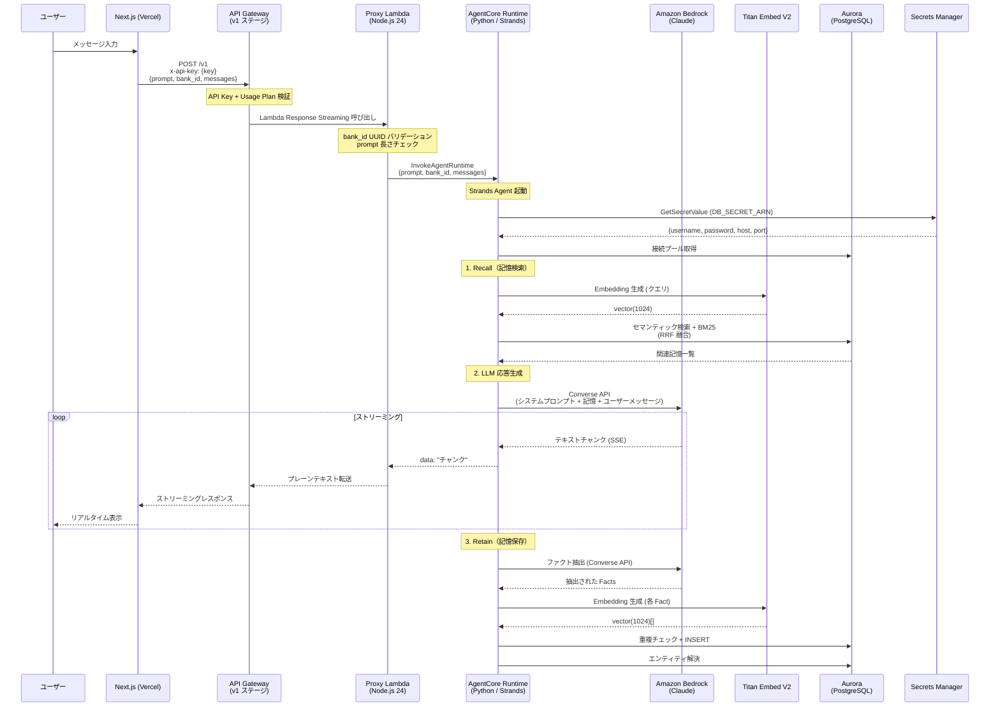
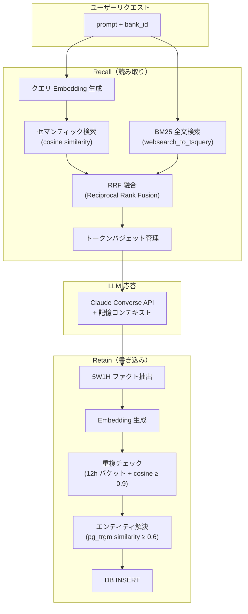
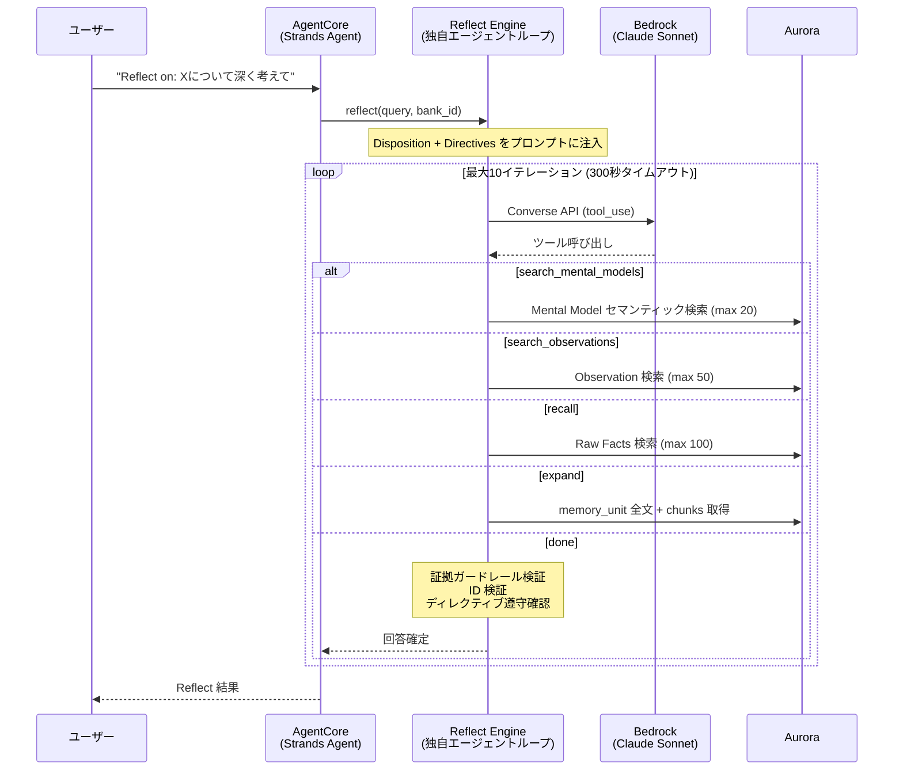

# E2E リクエストフロー

## チャットリクエスト（ストリーミング）

ユーザーがチャットメッセージを送信してから、ストリーミングレスポンスが返るまでの全体フロー。

```mermaid
sequenceDiagram
    participant User as ユーザー
    participant FE as Next.js (Vercel)
    participant APIGW as API Gateway<br/>(v1 ステージ)
    participant PL as Proxy Lambda<br/>(Node.js 24)
    participant AC as AgentCore Runtime<br/>(Python / Strands)
    participant BR as Amazon Bedrock<br/>(Claude)
    participant EMB as Titan Embed V2
    participant DB as Aurora<br/>(PostgreSQL)
    participant SM as Secrets Manager

    User->>FE: メッセージ入力

    FE->>APIGW: POST /v1<br/>x-api-key: {key}<br/>{prompt, bank_id, messages}

    Note over APIGW: API Key + Usage Plan 検証
    APIGW->>PL: Lambda Response Streaming 呼び出し

    Note over PL: bank_id UUID バリデーション<br/>prompt 長さチェック
    PL->>AC: InvokeAgentRuntime<br/>{prompt, bank_id, messages}

    Note over AC: Strands Agent 起動

    AC->>SM: GetSecretValue (DB_SECRET_ARN)
    SM-->>AC: {username, password, host, port}
    AC->>DB: 接続プール取得

    Note over AC: 1. Recall（記憶検索）
    AC->>EMB: Embedding 生成 (クエリ)
    EMB-->>AC: vector(1024)
    AC->>DB: セマンティック検索 + BM25<br/>(RRF 融合)
    DB-->>AC: 関連記憶一覧

    Note over AC: 2. LLM 応答生成
    AC->>BR: Converse API<br/>(システムプロンプト + 記憶 + ユーザーメッセージ)

    loop ストリーミング
        BR-->>AC: テキストチャンク (SSE)
        AC-->>PL: data: "チャンク"
        PL-->>APIGW: プレーンテキスト転送
        APIGW-->>FE: ストリーミングレスポンス
        FE-->>User: リアルタイム表示
    end

    Note over AC: 3. Retain（記憶保存）
    AC->>BR: ファクト抽出 (Converse API)
    BR-->>AC: 抽出された Facts
    AC->>EMB: Embedding 生成 (各 Fact)
    EMB-->>AC: vector(1024)[]
    AC->>DB: 重複チェック + INSERT
    AC->>DB: エンティティ解決
```

## 記憶システム統合フロー

AgentCore 内での記憶の読み書きフロー。

```mermaid
graph TB
    subgraph "ユーザーリクエスト"
        REQ["prompt + bank_id"]
    end

    subgraph "Recall（読み取り）"
        R1["クエリ Embedding 生成"]
        R2["セマンティック検索<br/>(cosine similarity)"]
        R3["BM25 全文検索<br/>(websearch_to_tsquery)"]
        R4["RRF 融合<br/>(Reciprocal Rank Fusion)"]
        R5["トークンバジェット管理"]
    end

    subgraph "LLM 応答"
        LLM["Claude Converse API<br/>+ 記憶コンテキスト"]
    end

    subgraph "Retain（書き込み）"
        W1["5W1H ファクト抽出"]
        W2["Embedding 生成"]
        W3["重複チェック<br/>(12h バケット + cosine ≥ 0.9)"]
        W4["エンティティ解決<br/>(pg_trgm similarity ≥ 0.6)"]
        W5["DB INSERT"]
    end

    REQ --> R1 --> R2
    REQ --> R3
    R2 --> R4
    R3 --> R4
    R4 --> R5 --> LLM

    LLM --> W1 --> W2 --> W3 --> W4 --> W5
```

## Reflect（深い推論）フロー

ユーザーが `reflect_on` ツールを使用した場合のフロー。

```mermaid
sequenceDiagram
    participant User as ユーザー
    participant AC as AgentCore<br/>(Strands Agent)
    participant REFLECT as Reflect Engine<br/>(独自エージェントループ)
    participant BR as Bedrock<br/>(Claude Sonnet)
    participant DB as Aurora

    User->>AC: "Reflect on: Xについて深く考えて"
    AC->>REFLECT: reflect(query, bank_id)

    Note over REFLECT: Disposition + Directives をプロンプトに注入

    loop 最大10イテレーション (300秒タイムアウト)
        REFLECT->>BR: Converse API (tool_use)
        BR-->>REFLECT: ツール呼び出し

        alt search_mental_models
            REFLECT->>DB: Mental Model セマンティック検索 (max 20)
        else search_observations
            REFLECT->>DB: Observation 検索 (max 50)
        else recall
            REFLECT->>DB: Raw Facts 検索 (max 100)
        else expand
            REFLECT->>DB: memory_unit 全文 + chunks 取得
        else done
            Note over REFLECT: 証拠ガードレール検証<br/>ID 検証<br/>ディレクティブ遵守確認
            REFLECT-->>AC: 回答確定
        end
    end

    AC-->>User: Reflect 結果
```
