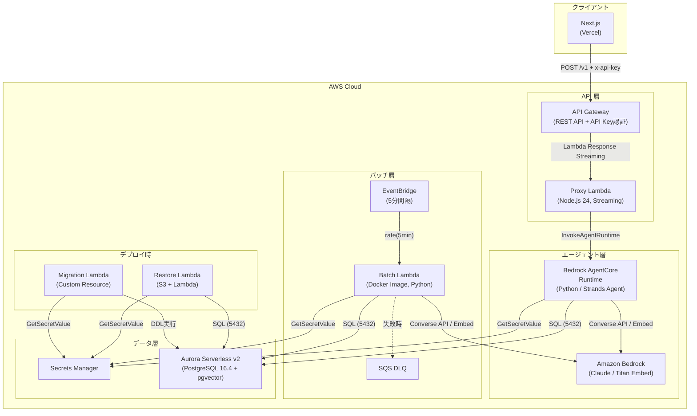
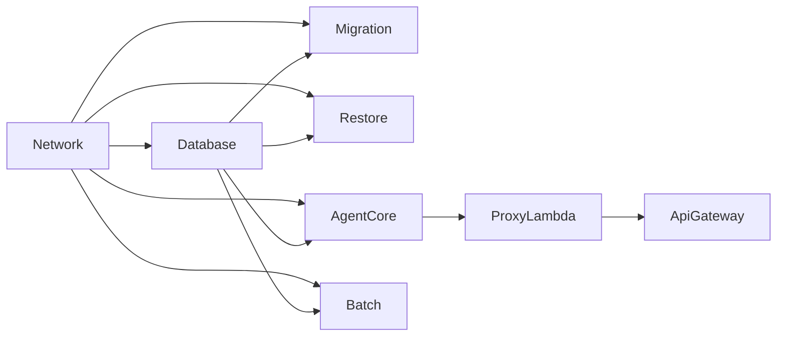

# AWS アーキテクチャ概要

## 全体構成

単一の CDK スタック（`MainStack`）に全リソースを定義。環境（dev/stg/prd）ごとにパラメータを切り替える。

リージョン: `ap-northeast-1`

## コンストラクト一覧

| # | コンストラクト | ファイル | 役割 |
|---|---|---|---|
| 1 | Network | `lib/constructs/network.ts` | VPC, サブネット, SG, VPC Endpoints |
| 2 | Database | `lib/constructs/database.ts` | Aurora Serverless v2 + Secrets Manager |
| 3 | Migration | `lib/constructs/migration.ts` | DB マイグレーション (Custom Resource) |
| 4 | Restore | `lib/constructs/restore.ts` | DB リストア (S3 + Lambda) |
| 5 | AgentCore | `lib/constructs/agentcore.ts` | Bedrock AgentCore Runtime |
| 6 | ProxyLambda | `lib/constructs/proxy-lambda.ts` | AgentCore 呼び出し用 Lambda |
| 7 | ApiGateway | `lib/constructs/api-gateway.ts` | REST API + API Key 認証 |
| 8 | Batch | `lib/constructs/batch.ts` | 定期バッチ Lambda + EventBridge |

## 依存関係

## 環境パラメータ差分

| パラメータ | dev | stg | prd |
|---|---|---|---|
| NAT Gateway | 1 | 1 | 1 |
| Aurora min ACU | 0.5 | 0.5 | 0.5 |
| Aurora max ACU | 2 | 2 | 8 |
| Aurora バックアップ保持 | 1日 | 1日 | 7日 |
| Aurora 削除保護 | false | false | true |
| Aurora RemovalPolicy | DESTROY | DESTROY | RETAIN |
| Batch 有効 | true | false | true |
| Batch メモリ | 1024MB | 1024MB | 1024MB |
| API 日次クォータ | 50 | 50 | 50 |
