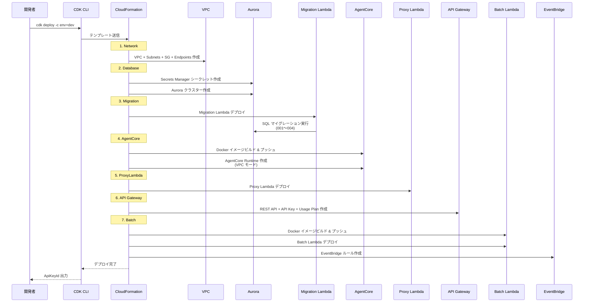

# デプロイフロー

## CDK プロジェクト構成

```
cdk/
├── bin/
│   └── myfriend.ts          # CDK App エントリポイント
├── lib/
│   ├── main-stack.ts         # メインスタック定義
│   └── constructs/
│       ├── network.ts        # VPC / SG / VPC Endpoints
│       ├── database.ts       # Aurora Serverless v2
│       ├── migration.ts      # DB マイグレーション
│       ├── agentcore.ts      # Bedrock AgentCore Runtime
│       ├── proxy-lambda.ts   # Proxy Lambda
│       ├── api-gateway.ts    # API Gateway
│       └── batch.ts          # Batch Lambda + EventBridge
├── parameter/
│   ├── index.ts              # 環境別パラメータ定義
│   ├── envname-type.ts       # 環境名バリデーション (zod)
│   └── validate-dotenv.ts    # .env バリデーション (zod)
└── resources/
    ├── proxy-lambda/
    │   └── index.ts          # Proxy Lambda 実装
    └── migration/
        ├── index.ts          # Migration Lambda 実装
        └── sql/
            ├── 001_extensions_aurora.sql
            ├── 002_short_term_aurora.sql
            ├── 003_mid_term.sql
            └── 004_long_term.sql
```

## デプロイコマンド

```bash
# 環境指定で synth
cd cdk
cdk synth -c env=dev

# デプロイ
cdk deploy -c env=dev

# 本番デプロイ
cdk deploy -c env=prd
```

## デプロイシーケンス



## 環境変数管理

### CDK 側 (.env.dev / .env.example)

| 変数 | 用途 |
|---|---|
| `ACCOUNT_ID` | AWS アカウント ID |

### AgentCore Runtime 環境変数

| 変数 | 値のソース | 用途 |
|---|---|---|
| `AWS_REGION` | `cdk.Stack.of(this).region` | Bedrock リージョン |
| `DB_SECRET_ARN` | Secrets Manager ARN | DB 認証情報取得 |
| `DB_HOST` | Aurora クラスターエンドポイント | DB ホスト |
| `DB_NAME` | `myfriend` | DB 名 |

### Batch Lambda 環境変数

| 変数 | 値のソース | 用途 |
|---|---|---|
| `DB_SECRET_ARN` | Secrets Manager ARN | DB 認証情報取得 |
| `DB_HOST` | Aurora クラスターエンドポイント | DB ホスト |
| `DB_NAME` | `myfriend` | DB 名 |

### Proxy Lambda 環境変数

| 変数 | 値のソース | 用途 |
|---|---|---|
| `AGENT_RUNTIME_ARN` | AgentCore Runtime ARN | AgentCore 呼び出し先 |

### Migration Lambda 環境変数

| 変数 | 値のソース | 用途 |
|---|---|---|
| `DB_SECRET_ARN` | Secrets Manager ARN | DB 認証情報取得 |
| `DB_NAME` | `myfriend` | DB 名 |

## スタック名

`{env}-Main2`（例: `dev-Main2`）

## タグ

| タグキー | 値 |
|---|---|
| `Project` | `myfriend` |
| `Cost` | `myfriend-{env}` |
| `Owner` | `sori883` |
