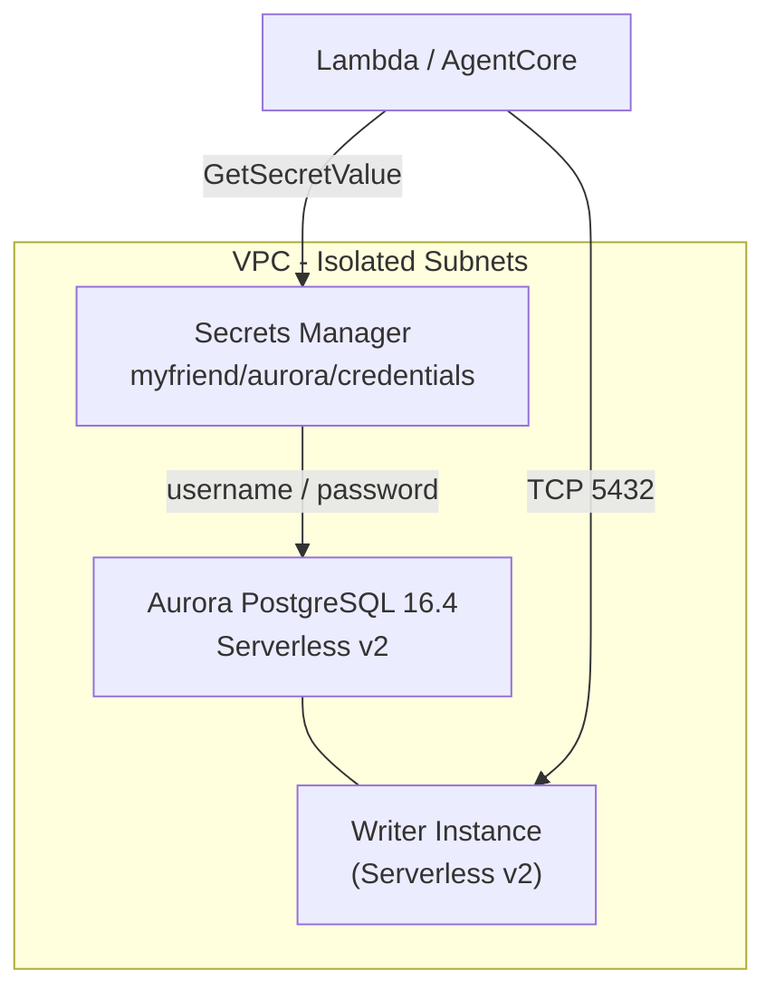
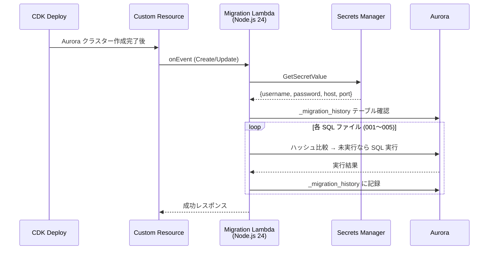

# データベース設計

## Aurora Serverless v2

| 項目 | 値 |
|---|---|
| エンジン | Aurora PostgreSQL 16.4 |
| スケーリング | Serverless v2 |
| min ACU | 0.5 (dev/stg), 0.5 (prd) |
| max ACU | 2 (dev/stg), 8 (prd) |
| Writer | 1 インスタンス（非公開） |
| Reader | なし |
| DB 名 | `myfriend` |
| 拡張 | pgvector, pg_trgm |
| 暗号化 | ストレージ暗号化有効 |
| サブネット | Isolated サブネット |

## Secrets Manager

- シークレット名: `myfriend/aurora/credentials`
- ユーザー名: `myfriend_admin`
- パスワード: 自動生成（30文字、句読点なし）
- アプリケーション側は `DB_SECRET_ARN` 環境変数で参照

## DB マイグレーション

CDK デプロイ時に Custom Resource Lambda が自動実行。

### マイグレーション SQL ファイル

| ファイル | 内容 |
|---|---|
| `001_extensions_aurora.sql` | pgvector, pg_trgm 等の拡張機能有効化 |
| `002_short_term_aurora.sql` | banks, memory_units, entities テーブル |
| `003_mid_term.sql` | memory_links, entity_cooccurrences, async_operations テーブル |
| `004_long_term.sql` | mental_models, chunks テーブル |
| `005_personalization.sql` | preference_profiles, recommendation_history テーブル、banks.owner_entity_id |

### べき等性

- `_migration_history` テーブルで各 SQL ファイルのハッシュを記録
- SQL ファイルのハッシュが変更された場合のみ CDK が再実行（`migrationHash` プロパティ）
