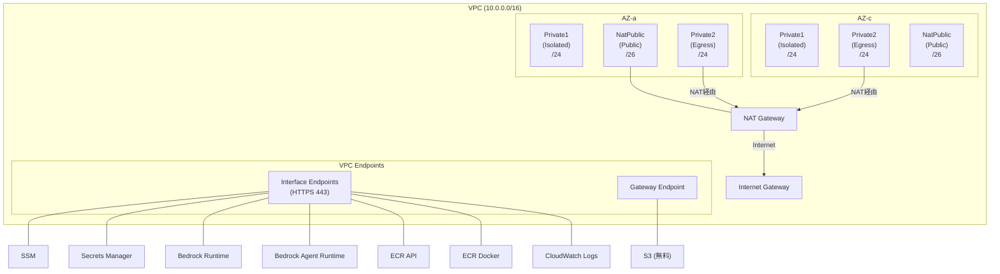
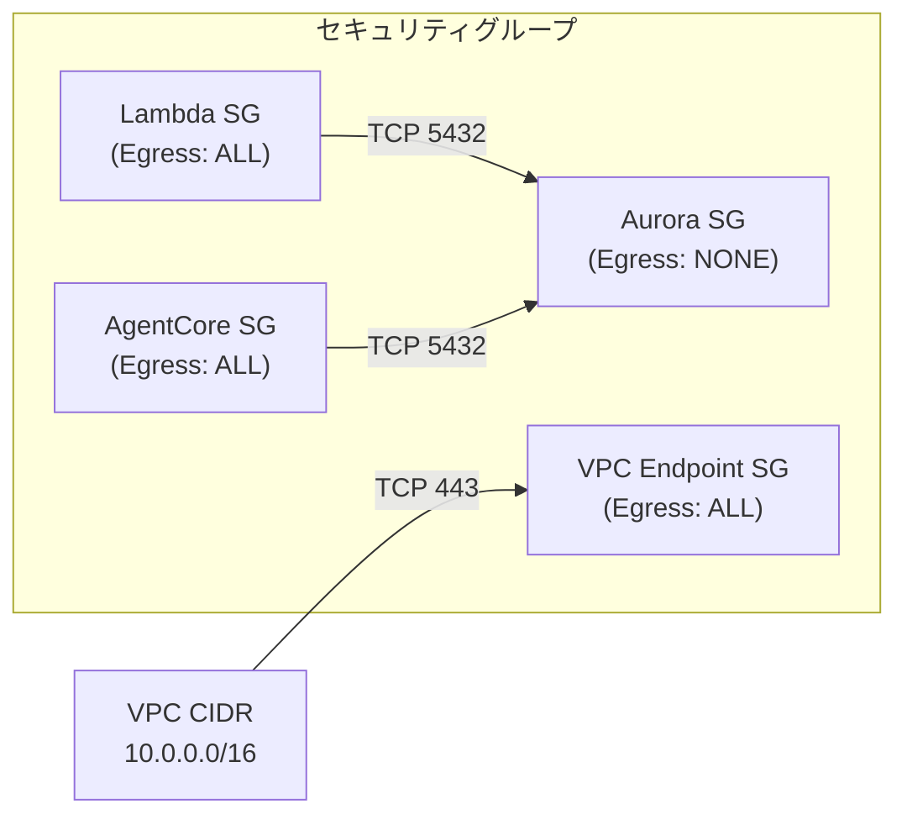

# ネットワーク設計

## VPC 構成

- CIDR: `10.0.0.0/16`
- AZ 数: 2
- NAT Gateway: 1（全環境共通）
- サブネット構成:
  - `Private1`: `PRIVATE_ISOLATED`（DB、Batch Lambda、VPC Endpoints 用）
  - `Private2`: `PRIVATE_WITH_EGRESS`（AgentCore 用、NAT Gateway 経由でインターネットアクセス可）
  - `NatPublic`: `PUBLIC`(/26)（NAT Gateway 配置用、自動作成）

## セキュリティグループ

| SG | Inbound | Outbound | 用途 |
|---|---|---|---|
| Lambda SG | - | ALL | Batch Lambda 用（Private1 配置） |
| AgentCore SG | - | ALL | AgentCore 用（Private2 配置、NAT 経由） |
| Aurora SG | Lambda SG / AgentCore SG → TCP 5432 | なし | Aurora クラスター用 |
| VPC Endpoint SG | VPC CIDR → TCP 443 | ALL | VPC Endpoints 用 |

## VPC Endpoints 一覧

| エンドポイント | タイプ | 用途 |
|---|---|---|
| SSM | Interface | Systems Manager パラメータ |
| Secrets Manager | Interface | DB 認証情報取得 |
| Bedrock Runtime | Interface | LLM / Embedding 呼び出し |
| Bedrock Agent Runtime | Interface | Rerank API |
| ECR API | Interface | AgentCore コンテナイメージ取得 |
| ECR Docker | Interface | AgentCore コンテナイメージ取得 |
| CloudWatch Logs | Interface | AgentCore ログ出力 |
| S3 | Gateway | ECR レイヤーキャッシュ等（無料） |

全 Interface Endpoint は Private DNS 有効、`Private1` サブネットに配置。
