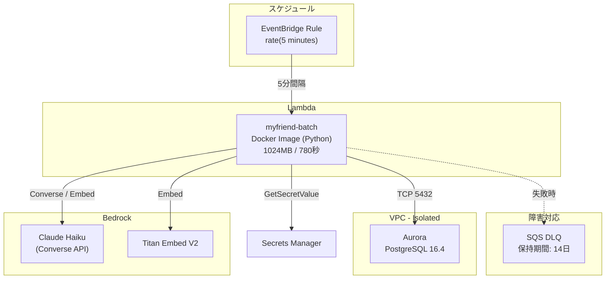
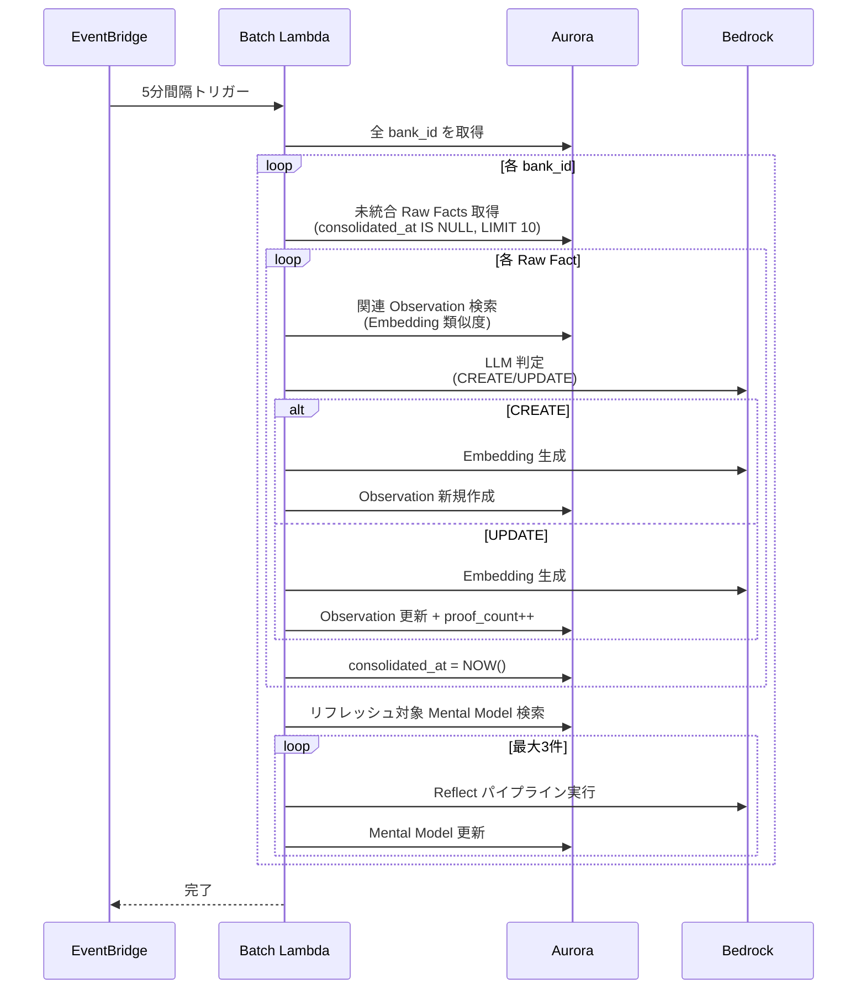

# バッチ処理設計

## 構成

## Batch Lambda

| 項目 | 値 |
|---|---|
| 関数名 | `myfriend-batch` |
| イメージ | `batch/Dockerfile` からビルド |
| メモリ | 1024MB |
| タイムアウト | 780秒（13分） |
| 配置 | VPC Isolated サブネット |
| 環境変数 | `DB_SECRET_ARN`, `DB_HOST`, `DB_NAME` |

### IAM 権限

| 権限 | リソース | 用途 |
|---|---|---|
| `bedrock:*` | `*` | Consolidation / Reflect での LLM 呼び出し |
| Secrets Manager Read | DB シークレット | DB 認証情報取得 |

## 処理内容

Batch Lambda は記憶システムの中期・長期記憶を更新する。

## EventBridge スケジュール

| 項目 | 値 |
|---|---|
| ルール名 | `myfriend-batch-schedule` |
| スケジュール | `rate(5 minutes)` |
| dev 環境 | 有効 |
| stg 環境 | **無効** |
| prd 環境 | 有効 |

## DLQ (Dead Letter Queue)

| 項目 | 値 |
|---|---|
| キュー名 | `myfriend-batch-dlq` |
| メッセージ保持期間 | 14日 |

Lambda 実行失敗時にイベントが DLQ に送信される。
