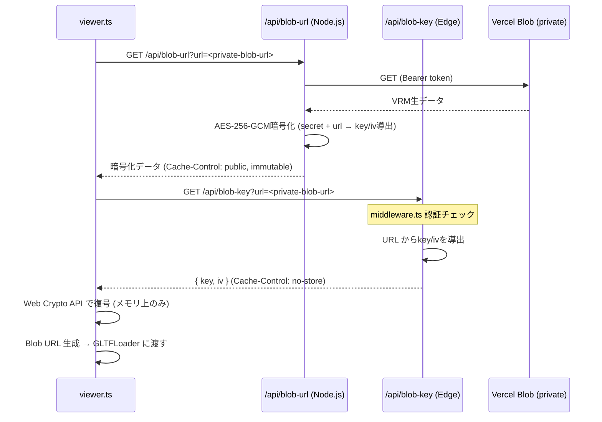

# VRMモデル保護（暗号化配信）

Vercel Blob (private) に保存されたVRMモデルをAES-256-GCMで暗号化して配信する。

## 背景

Webアプリでは、VRMファイルをブラウザに送信する必要があるため、
何の対策もないとDevToolsのネットワークタブやブラウザキャッシュから容易にモデルを取得できてしまう。

本機能では暗号化配信により「容易に取り出せない状態」を実現する。

## 目的

- VRMファイルの生データがブラウザキャッシュやCDN上に残ることを防ぐ
- DevToolsやcURLでの直接ダウンロードを困難にする
- CDNキャッシュの恩恵を維持する（暗号化済みデータはキャッシュ可能）

## ファイル構成

| ファイル | ランタイム | 役割 |
|---------|-----------|------|
| `utils/encoding.ts` | 共通 | Base64⇔バイナリ変換の共通ユーティリティ |
| `utils/blobEncryption.ts` | サーバー | AES-256-GCMキー導出・暗号化 |
| `utils/blobDecryption.ts` | クライアント | AES-256-GCM復号（Web Crypto API） |
| `pages/api/blob-url.ts` | Node.js Serverless | 暗号化済みVRMデータを配信 |
| `pages/api/blob-key.ts` | Edge | 復号キーを配信（no-store） |
| `features/vrmViewer/viewer.ts` | クライアント | 暗号化VRMの復号・ロード |

## シーケンス

## 暗号化方式

| 項目 | 内容 |
|------|------|
| アルゴリズム | AES-256-GCM |
| キー導出 | HMAC-SHA256(`BLOB_ENCRYPTION_SECRET`, `blob-key:<url>`) |
| IV導出 | HMAC-SHA256(`BLOB_ENCRYPTION_SECRET`, `blob-iv:<url>`) の先頭12バイト |
| nonce再利用対策 | Vercel Blob は content-addressed（URLが内容に基づく）のため、URL のみで一意性を保証。ファイル差し替え時はシークレットをローテーションするか別 URL にアップロード |

### キー/IV導出が決定的である理由

同じURLに対して常に同じキー/IVを生成する。これにより:

- **CDNキャッシュが有効**: 暗号化済みレスポンスをキャッシュしても、キーなしでは復号不能
- **毎回の暗号化を回避**: CDNキャッシュヒット時はサーバー側の暗号化処理が不要
- **HEADリクエスト不要**: ETagを使わないため、キー導出時のBlobアクセスが不要

Vercel BlobのURLは content-addressed（内容に基づくURL）であるため、
同一URLで内容が変わることは基本的にない。

## セキュリティ設計

| 脅威 | 対策 |
|------|------|
| SSRF（URLバリデーション回避） | `new URL()` パース + 正規表現 `^[a-z0-9]+\.private\.blob\.vercel-storage\.com$` + https強制 |
| Bearerトークン漏洩 | 厳密なURL検証で攻撃者サーバーへの送信を防止 |
| CDN上での生データ露出 | 暗号化済みデータのみキャッシュ (`Cache-Control: public, immutable`) |
| 復号キーのキャッシュ | `/api/blob-key` は `Cache-Control: private, no-store` |
| ブラウザキャッシュに生データ残存 | 復号はメモリ上のみ。Blob URLは `unloadVRM()` 時に `revokeObjectURL()` で解放 |
| Node.js Serverless メモリ不足 | Content-Length検査で100MB超を拒否 + 30秒タイムアウト |

## ランタイム選択

| エンドポイント | ランタイム | 理由 |
|---------------|-----------|------|
| `/api/blob-url` | **Node.js Serverless** | VRMファイル（最大100MB）の全量読み込み + 暗号化にはEdge Runtime（128MB制限）では不足。Serverless（最大1024MB）を使用 |
| `/api/blob-key` | **Edge** | HEADリクエスト + キー導出のみで軽量。低レイテンシのEdgeが適切 |

## 環境変数

| 変数名 | 必須 | 説明 |
|--------|------|------|
| `BLOB_READ_WRITE_TOKEN` | Blob使用時 | Vercel Blob認証トークン（既存） |
| `BLOB_ENCRYPTION_SECRET` | 任意 | 暗号化キー導出用シークレット。設定で暗号化有効、未設定でフォールバック |

## フォールバック動作

`BLOB_ENCRYPTION_SECRET` が未設定の場合:

- VRMデータは暗号化されず生データとしてプロキシ配信
- `Cache-Control: private, no-store` でキャッシュを無効化
- 再訪問時も毎回フルダウンロードが発生する（パフォーマンス低下）
