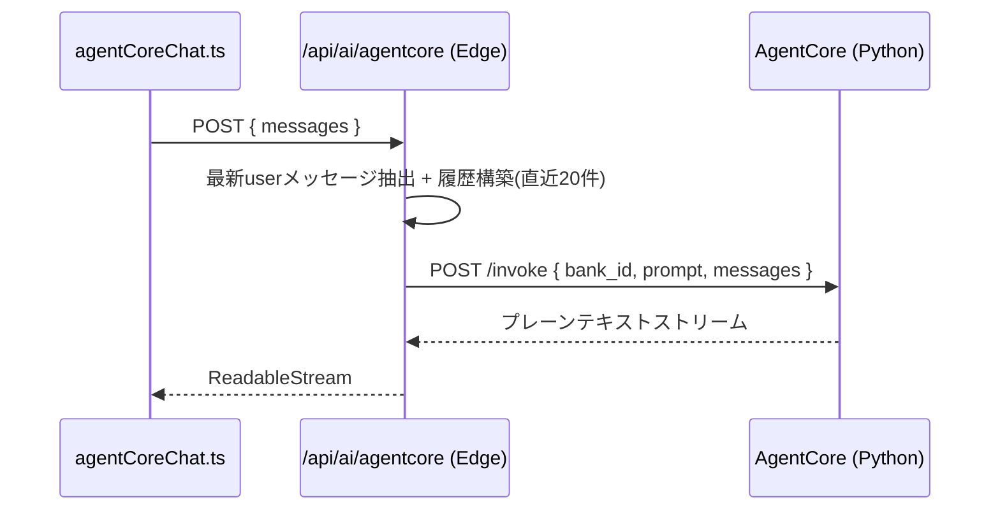
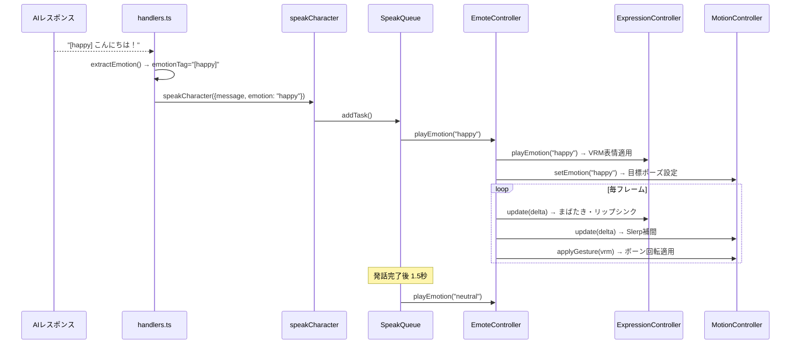

# フロントエンド設計概要

AITuberKit ベース。ライブラリ側の仕組みは割愛し、本プロジェクト独自の実装のみ記載する。

## AgentCore 連携

AIプロバイダーとして `agentcore` を追加。バックエンドの Strands Agent と通信する。

### ファイル構成

| ファイル | 役割 |
|---------|------|
| `features/chat/agentCoreChat.ts` | クライアント側ストリーム変換 |
| `pages/api/ai/agentcore.ts` | Edge API ルート (プロキシ) |

### シーケンス

### 環境変数

| 変数名 | 説明 |
|--------|------|
| `AGENTCORE_URL` | バックエンドURL (default: `http://localhost:8080`) |
| `AGENTCORE_BANK_ID` | メモリバンクID (UUID, 必須) |
| `AGENTCORE_API_KEY` | API認証キー (任意) |

## 表情・ジェスチャー制御

AI応答の感情タグ `[emotion]` に基づき、VRMモデルの表情(Expression)とボディジェスチャー(MotionController)を制御する。

### ファイル構成

| ファイル | 役割 |
|---------|------|
| `features/emoteController/emoteController.ts` | Expression + Motion の統合制御 |
| `features/emoteController/expressionController.ts` | VRM表情管理 (自動まばたき・リップシンク含む) |
| `features/emoteController/motionController.ts` | ボーン回転によるジェスチャー制御 |
| `features/emoteController/motionConstants.ts` | 感情別ポーズ・呼吸・揺れの定数定義 |

### 感情タグの流れ

### 感情タイプとジェスチャー

6種類の感情に対応。各感情でボーン回転オフセット(度数)を定義。

| 感情 | 体の動き | 手の動き |
|------|---------|---------|
| neutral | なし | なし |
| happy | 頭上向き、体を軽く反らす | 指を伸ばす(開いた手) |
| sad | うつむき、前かがみ | 力なく曲がる |
| angry | 頭を前に、前のめり | 握り拳 |
| relaxed | 頭を横に傾ける | 自然に軽く曲げる |
| surprised | 頭を後ろに引く、仰け反る | パッと開く |

ジェスチャー遷移は Slerp 補間 (速度 3.0) でスムーズに行われる。

### 常時モーション

アイドルアニメーション上に加算される自律的な動き:

- **呼吸**: chest ボーンを pitch 方向に ±1.5° (0.25Hz)
- **微揺れ**: spine ボーンを roll 方向に ±0.8° (0.1Hz)

## VRMモデル保護（暗号化配信）

→ 詳細は [モデル保護.md](モデル保護.md) を参照
