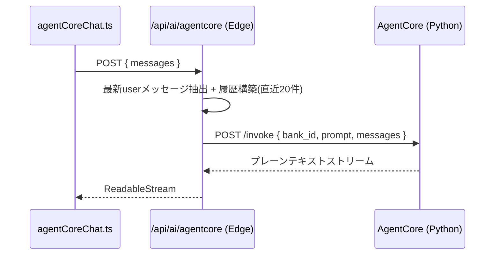
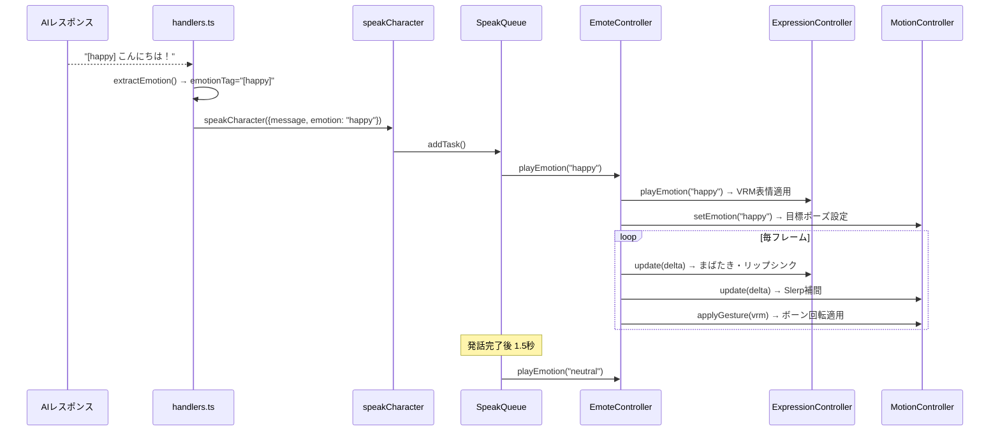
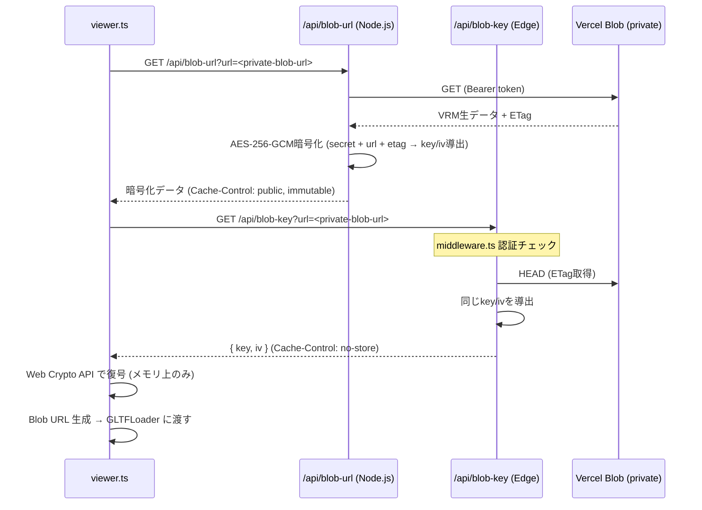

# フロントエンド設計概要

AITuberKit ベース。ライブラリ側の仕組みは割愛し、本プロジェクト独自の実装のみ記載する。

## AgentCore 連携

AIプロバイダーとして `agentcore` を追加。バックエンドの Strands Agent と通信する。

### ファイル構成

| ファイル | 役割 |
|---------|------|
| `features/chat/agentCoreChat.ts` | クライアント側ストリーム変換 |
| `pages/api/ai/agentcore.ts` | Edge API ルート (プロキシ) |

### シーケンス

### 環境変数

| 変数名 | 説明 |
|--------|------|
| `AGENTCORE_URL` | バックエンドURL (default: `http://localhost:8080`) |
| `AGENTCORE_BANK_ID` | メモリバンクID (UUID, 必須) |
| `AGENTCORE_API_KEY` | API認証キー (任意) |

## 表情・ジェスチャー制御

AI応答の感情タグ `[emotion]` に基づき、VRMモデルの表情(Expression)とボディジェスチャー(MotionController)を制御する。

### ファイル構成

| ファイル | 役割 |
|---------|------|
| `features/emoteController/emoteController.ts` | Expression + Motion の統合制御 |
| `features/emoteController/expressionController.ts` | VRM表情管理 (自動まばたき・リップシンク含む) |
| `features/emoteController/motionController.ts` | ボーン回転によるジェスチャー制御 |
| `features/emoteController/motionConstants.ts` | 感情別ポーズ・呼吸・揺れの定数定義 |

### 感情タグの流れ

### 感情タイプとジェスチャー

6種類の感情に対応。各感情でボーン回転オフセット(度数)を定義。

| 感情 | 体の動き | 手の動き |
|------|---------|---------|
| neutral | なし | なし |
| happy | 頭上向き、体を軽く反らす | 指を伸ばす(開いた手) |
| sad | うつむき、前かがみ | 力なく曲がる |
| angry | 頭を前に、前のめり | 握り拳 |
| relaxed | 頭を横に傾ける | 自然に軽く曲げる |
| surprised | 頭を後ろに引く、仰け反る | パッと開く |

ジェスチャー遷移は Slerp 補間 (速度 3.0) でスムーズに行われる。

### 常時モーション

アイドルアニメーション上に加算される自律的な動き:

- **呼吸**: chest ボーンを pitch 方向に ±1.5° (0.25Hz)
- **微揺れ**: spine ボーンを roll 方向に ±0.8° (0.1Hz)

## VRMモデル暗号化配信

Vercel Blob (private) に保存されたVRMモデルをAES-256-GCMで暗号化して配信する。
VN3ライセンス等の「再配布禁止・容易に取り出せない状態でのソフトウェア組み込みは許可」に対応する。

### 目的

- VRMファイルの生データがブラウザキャッシュやCDN上に残ることを防ぐ
- DevToolsやcURLでの直接ダウンロードを困難にする
- CDNキャッシュの恩恵を維持する（暗号化済みデータはキャッシュ可能）

### ファイル構成

| ファイル | 役割 |
|---------|------|
| `utils/blobEncryption.ts` | AES-256-GCMキー導出・暗号化（サーバーサイド） |
| `utils/blobDecryption.ts` | AES-256-GCM復号（クライアントサイド / Web Crypto API） |
| `utils/encoding.ts` | Base64⇔バイナリ変換の共通ユーティリティ |
| `pages/api/blob-url.ts` | 暗号化済みVRMデータを配信（Node.js Serverless Runtime） |
| `pages/api/blob-key.ts` | 復号キーを配信（Edge Runtime / no-store） |
| `features/vrmViewer/viewer.ts` | 暗号化VRMの復号・ロード |

### シーケンス

### 暗号化方式

| 項目 | 内容 |
|------|------|
| アルゴリズム | AES-256-GCM |
| キー導出 | HMAC-SHA256(`BLOB_ENCRYPTION_SECRET`, `blob-key:<url>:<etag>`) |
| IV導出 | HMAC-SHA256(`BLOB_ENCRYPTION_SECRET`, `blob-iv:<url>:<etag>`) の先頭12バイト |
| nonce再利用対策 | ETagをキー導出に含め、同一URLで内容が変わっても異なるキー/IVを生成 |

### セキュリティ設計

| 脅威 | 対策 |
|------|------|
| SSRF（URLバリデーション回避） | `new URL()` パース + 正規表現 `^[a-z0-9]+\.private\.blob\.vercel-storage\.com$` + https強制 |
| Bearerトークン漏洩 | 厳密なURL検証で攻撃者サーバーへの送信を防止 |
| CDN上での生データ露出 | 暗号化済みデータのみキャッシュ (`Cache-Control: public, immutable`) |
| 復号キーのキャッシュ | `/api/blob-key` は `Cache-Control: private, no-store` |
| メモリリーク | `unloadVRM()` で `URL.revokeObjectURL()` を呼び出し |
| Edge Runtimeメモリ不足 | `blob-url.ts` をNode.js Serverless Runtimeで実行（最大1024MB） |
| 大容量ファイルによるOOM | Content-Length検査で100MB超を拒否 + 30秒タイムアウト |

### 環境変数

| 変数名 | 説明 |
|--------|------|
| `BLOB_READ_WRITE_TOKEN` | Vercel Blob認証トークン（既存） |
| `BLOB_ENCRYPTION_SECRET` | 暗号化キー導出用シークレット。設定で暗号化有効、未設定でフォールバック（no-store配信） |

### フォールバック動作

`BLOB_ENCRYPTION_SECRET` が未設定の場合:
- VRMデータは暗号化されず生データとしてプロキシ配信
- `Cache-Control: private, no-store` でキャッシュを無効化
- 再訪問時も毎回フルダウンロードが発生する
