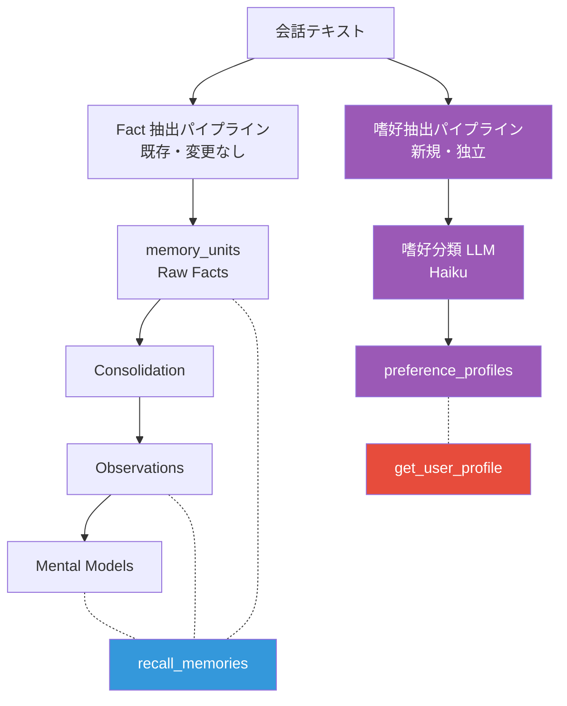
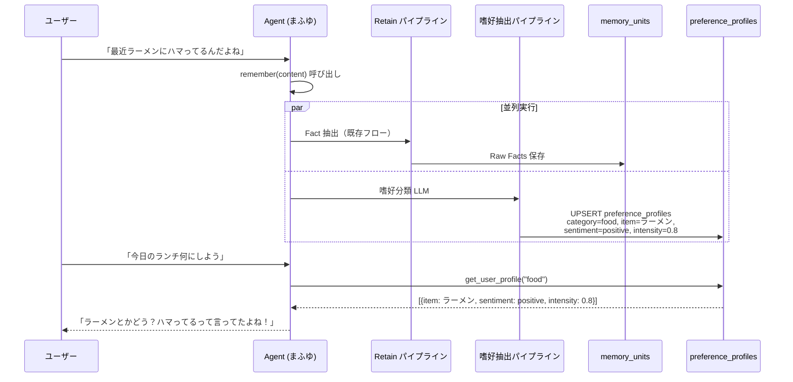
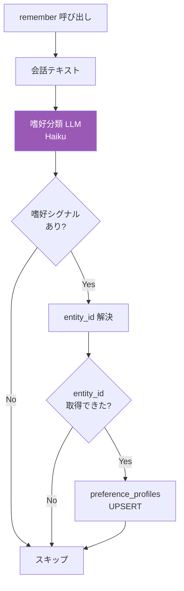
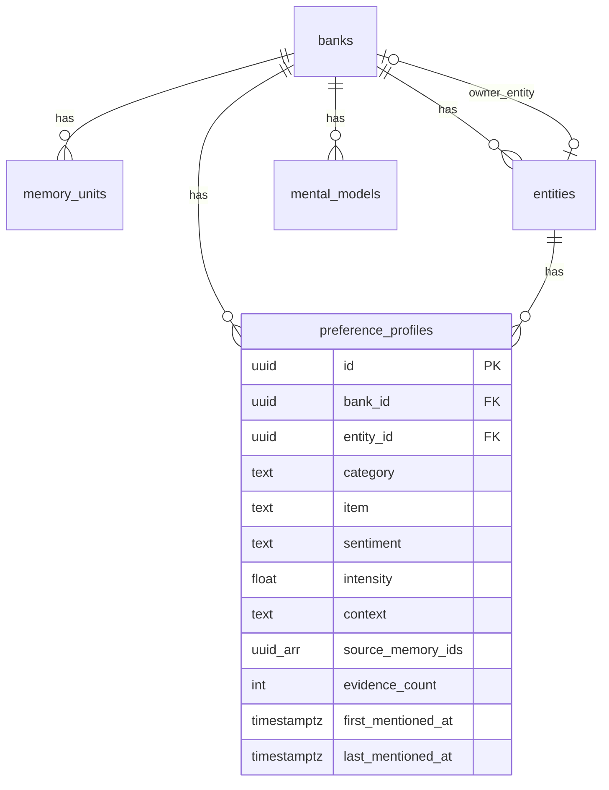

# パーソナライズシステム設計

ユーザーの嗜好・価値観・行動パターンを構造的に捉え、パーソナライズされた情報提供を実現する。

## 1. 設計方針

### 1.1 エージェントに提供する2つのツール

| ツール | 用途 | データソース |
|--------|------|-------------|
| `recall_memories` (既存) | 対話の記憶を検索する | memory_units / observations / mental_models |
| `get_user_profile` (新規) | ユーザーの趣味嗜好を取得する | preference_profiles |

2つのツールは**異なるアクセスパターン**を持つため、データストアも分離する。

### 1.2 既存パイプラインへの影響

| コンポーネント | 変更 |
|---------------|------|
| Retain パイプライン (retain.py) | **変更なし** |
| Fact 抽出 (extraction.py) | **変更なし** |
| Consolidation Worker | **変更なし** |
| memory_units テーブル | **変更なし** |
| Recall パイプライン (recall.py) | **変更なし** |

既存コードへの変更はゼロ。嗜好抽出は Retain と並列に動く**完全に独立したパイプライン**として実装する。

## 2. アーキテクチャ

会話テキストから2つの独立したパイプラインでデータを抽出し、それぞれ別のテーブルに格納する。



### 設計原則

1. **完全分離**: 2つのパイプラインは互いに依存しない。一方が失敗しても他方に影響しない
2. **生テキストから抽出**: 嗜好は生の会話テキストから直接抽出する（Observation からの抽出は抽象度が高すぎるため）
3. **既存コード変更ゼロ**: 既存の Retain / Consolidation / Recall は一切変更しない

## 3. データフロー



## 4. 嗜好抽出パイプライン

### 4.1 実行タイミング

`remember()` 呼び出し時に、既存の Fact 抽出と**並列**で実行する。

```python
# agentcore/core.py の remember ツール内
async def _remember(bank_id, content, context):
    # memory パッケージと recommendation パッケージを並列実行
    fact_result, pref_result = await asyncio.gather(
        memory_engine.retain(bank_id, content, context),           # 既存（memory パッケージ）
        preference_engine.extract(bank_id, content, context),      # 新規（recommendation パッケージ）
        return_exceptions=True,
    )
    # pref_result が例外でも fact_result は正常に返す
```

- 並列実行の制御は `agentcore/core.py` が行う（memory / recommendation パッケージは互いに独立）
- Fact 抽出の成否に関わらず嗜好抽出が動く
- 嗜好抽出が失敗しても Fact 抽出（既存機能）には影響しない
- Consolidation を待たないため、嗜好データが**即座に**利用可能

### 4.2 処理フロー



### 4.3 嗜好分類 LLM

会話テキストから嗜好情報を構造化抽出する。

#### モデル

- Claude 3 Haiku（`anthropic.claude-3-haiku-20240307-v1:0`）
- Temperature: 0.0
- Max tokens: 1024

#### プロンプト

```
あなたは嗜好分類エンジンです。
会話テキストからユーザーの嗜好・好み・価値観を構造化して抽出してください。

ルール:
- 嗜好に関連しない会話は空配列 [] を返す
- 1つのテキストから複数の嗜好を抽出してもよい
- 具体的なアイテム名を使う（「味噌ラーメン」→ ○、「食べ物」→ ×）

抽出基準（重要）:
- 明示的な嗜好表現がある場合のみ抽出すること
  ○ 抽出する: 「好き」「嫌い」「ハマっている」「苦手」「大好き」「お気に入り」「〜が趣味」
  × 抽出しない: 「〜した」「〜に行った」「〜を使っている」（行動の報告であり嗜好の表明ではない）
  × 抽出しない: 「〜を食べた」（食べただけでは好きかどうか不明）
- 迷った場合は抽出しない

出力形式（JSON配列のみ返すこと）:
[
  {
    "category": "嗜好カテゴリ",
    "item": "具体的なアイテム名（簡潔に）",
    "sentiment": "positive | negative | neutral",
    "intensity": 0.0〜1.0
  }
]

嗜好カテゴリ一覧:
- food: 食べ物・飲み物
- music: 音楽
- entertainment: 映画・ドラマ・ゲーム・漫画・アニメ（消費型の娯楽）
- hobby: 趣味・創作活動
- sport: スポーツ・運動（身体を動かす活動）
- place: 場所・旅行
- work: 仕事・キャリア
- lifestyle: ライフスタイル・習慣（飲食物以外）
- social: 人間関係・コミュニケーション
- value: 価値観・信念
- fashion: ファッション・見た目
- learning: 学習・知識

カテゴリ優先ルール（迷った場合は以下に従うこと）:
- 飲食物 → 常に food（lifestyle ではない）
- 身体を動かす活動 → 常に sport（hobby ではない）
- 創作・制作活動 → 常に hobby（work ではない）
- 消費型の娯楽（映画鑑賞、ゲーム、漫画、音楽鑑賞） → 常に entertainment
- 能動的に演奏・作曲する場合 → music
- 学習目的の活動 → 常に learning（hobby ではない）

intensity の基準:
- 「大好き」「最高」「絶対」→ 0.9-1.0
- 「好き」「いい」「ハマってる」→ 0.6-0.8
- 「まあまあ」「興味ある」→ 0.4-0.5
- 「あまり好きじゃない」→ 0.3-0.4 (negative)
- 「嫌い」「無理」「苦手」→ 0.7-1.0 (negative)
```

### 4.4 エンティティの特定

嗜好を「誰の」嗜好として紐付けるか。

#### 解決方針

1. 会話テキストの `who` をエンティティ解決（既存の `entity.py` を再利用）
2. `who` が特定できない場合 → bank の `owner_entity_id` を使用
3. `owner_entity_id` も未設定 → スキップ（嗜好を保存しない）

#### owner_entity_id の設定

`banks` テーブルに `owner_entity_id` を追加する。

```sql
ALTER TABLE banks
    ADD COLUMN IF NOT EXISTS owner_entity_id UUID REFERENCES entities(id);
```

設定タイミング:
- bank 作成時に明示的に設定（API / 管理画面）
- または、最初の Retain で作成されたエンティティを自動設定（最初の `who` に出現した人物）

## 5. DB スキーマ

### 5.1 preference_profiles テーブル

```sql
-- 005_personalization.sql

CREATE TABLE preference_profiles (
    id UUID PRIMARY KEY DEFAULT gen_random_uuid(),
    bank_id UUID NOT NULL REFERENCES banks(id) ON DELETE CASCADE,
    entity_id UUID NOT NULL REFERENCES entities(id) ON DELETE CASCADE,

    -- 構造化嗜好
    category TEXT NOT NULL,
    item TEXT NOT NULL,
    sentiment TEXT NOT NULL DEFAULT 'positive',
    intensity FLOAT NOT NULL DEFAULT 0.5,
    context TEXT,

    -- 証拠
    source_memory_ids UUID[] NOT NULL DEFAULT '{}',
    evidence_count INTEGER NOT NULL DEFAULT 1,

    -- 時系列
    first_mentioned_at TIMESTAMPTZ NOT NULL DEFAULT NOW(),
    last_mentioned_at TIMESTAMPTZ NOT NULL DEFAULT NOW(),
    created_at TIMESTAMPTZ NOT NULL DEFAULT NOW(),
    updated_at TIMESTAMPTZ NOT NULL DEFAULT NOW(),

    -- 同一 entity × category × item で1レコード
    UNIQUE(bank_id, entity_id, category, item)
);

-- インデックス
CREATE INDEX idx_pref_bank_entity
    ON preference_profiles(bank_id, entity_id);

CREATE INDEX idx_pref_category
    ON preference_profiles(bank_id, entity_id, category);

-- banks テーブル拡張
ALTER TABLE banks
    ADD COLUMN IF NOT EXISTS owner_entity_id UUID REFERENCES entities(id);
```

### 5.2 ER 図



## 6. preference_profiles の更新ルール

### 6.1 UPSERT ロジック

```sql
INSERT INTO preference_profiles
    (bank_id, entity_id, category, item, sentiment, intensity,
     source_memory_ids, evidence_count,
     first_mentioned_at, last_mentioned_at)
VALUES ($1, $2, $3, $4, $5, $6, ARRAY[$7], 1, NOW(), NOW())
ON CONFLICT (bank_id, entity_id, category, item) DO UPDATE SET
    sentiment = EXCLUDED.sentiment,
    intensity = preference_profiles.intensity * 0.7 + EXCLUDED.intensity * 0.3,
    source_memory_ids = array_cat(
        preference_profiles.source_memory_ids, EXCLUDED.source_memory_ids
    ),
    evidence_count = preference_profiles.evidence_count + 1,
    last_mentioned_at = NOW(),
    updated_at = NOW();
```

### 6.2 intensity 更新ルール

| 状況 | ルール |
|------|--------|
| 新規 | LLM 出力の intensity をそのまま使用 |
| 再言及（同じ sentiment） | 指数移動平均: `new = old * 0.7 + extracted * 0.3` |
| sentiment 変化 | 新しい sentiment で上書き、context に変更理由を記録 |

### 6.3 item の名寄せ

LLM の出力する item 名がブレる問題（「ラーメン」「味噌ラーメン」「らーめん」）への対策。

**UPSERT 前に既存レコードとの類似度チェック**を行う:

```python
async def _find_similar_item(
    conn: asyncpg.Connection,
    bank_id: str,
    entity_id: str,
    category: str,
    item: str,
    threshold: float = 0.6,
) -> str | None:
    """pg_trgm similarity で既存 item との類似度を確認する。

    閾値以上の類似度を持つ既存 item があれば、そちらの item 名を返す。
    → UPSERT 時に既存レコードにマージされる。
    """
    row = await conn.fetchrow(
        """SELECT item, similarity(item, $1) AS sim
           FROM preference_profiles
           WHERE bank_id = $2 AND entity_id = $3 AND category = $4
           ORDER BY sim DESC
           LIMIT 1""",
        item, bank_id, entity_id, category,
    )
    if row and row["sim"] >= threshold:
        return row["item"]
    return None
```

例:
- 既存: `item = "ラーメン"`
- 新規: `item = "味噌ラーメン"` → similarity 0.67 → 既存の「ラーメン」にマージ
- 新規: `item = "寿司"` → similarity 0.0 → 新規レコード作成

## 7. get_user_profile ツール

### 7.1 インターフェース

```python
@tool
def get_user_profile(category: str = "") -> str:
    """ご主人様の好みや嗜好を確認する。
    特定のカテゴリ（food, music, hobby等）を指定するか、
    空文字で全カテゴリの概要を取得する。

    Args:
        category: 嗜好カテゴリ（省略可）
    """
```

### 7.2 レスポンス例

```json
{
  "entity": "ご主人様",
  "preferences": {
    "food": [
      {"item": "ラーメン", "sentiment": "positive", "intensity": 0.8,
       "evidence_count": 3, "last_mentioned": "2025-03-01"},
      {"item": "パクチー", "sentiment": "negative", "intensity": 0.9,
       "evidence_count": 1, "last_mentioned": "2025-02-15"}
    ],
    "hobby": [
      {"item": "プログラミング", "sentiment": "positive", "intensity": 0.7,
       "evidence_count": 5, "last_mentioned": "2025-03-02"}
    ]
  },
  "total_count": 3
}
```

### 7.3 クエリ

```sql
-- カテゴリ指定あり
SELECT category, item, sentiment, intensity, evidence_count, last_mentioned_at
FROM preference_profiles
WHERE bank_id = $1 AND entity_id = $2 AND category = $3
ORDER BY intensity DESC, evidence_count DESC;

-- カテゴリ指定なし（全件）
SELECT category, item, sentiment, intensity, evidence_count, last_mentioned_at
FROM preference_profiles
WHERE bank_id = $1 AND entity_id = $2
ORDER BY category, intensity DESC;
```

### 7.4 ツール使い分けガイド（System Prompt に追記）

```
## ツールの使い分け

- **recall_memories**: 過去の会話内容や出来事を思い出すとき
  - 「前に○○って言ってたよね」のような過去の会話参照
  - 「いつ○○した？」のような時間に関する質問
  - 特定のエピソードや会話の文脈を思い出すとき

- **get_user_profile**: ご主人様の好みや傾向を知りたいとき
  - 何かを提案・おすすめするとき（食べ物、趣味、プレゼント等）
  - ご主人様の好き嫌いを確認するとき
  - 話題を選ぶとき

※ 迷ったら get_user_profile を先に使い、具体的なエピソードが必要なら recall_memories で補完する
```

## 8. コスト見積もり

### 8.1 1回あたりの追加コスト

Claude 3 Haiku（$0.25/1M input, $1.25/1M output）で試算。

| 項目 | トークン数 | コスト |
|------|-----------|--------|
| 嗜好分類 Input（プロンプト + 会話テキスト） | ~900 | $0.000225 |
| 嗜好分類 Output（JSON 配列） | ~150 | $0.000188 |
| **合計** | | **~$0.0004 / 回** |

### 8.2 月間コスト（1日20回 remember 想定）

| コンポーネント | モデル | 月間コスト | 割合 |
|---------------|--------|-----------|------|
| Fact 抽出 | Haiku | ~$0.54 | 9% |
| Consolidation 判定 | Haiku | ~$0.54 | 9% |
| Reflect | **Sonnet** | ~$4.50 | **75%** |
| Embedding | Titan | ~$0.18 | 3% |
| **嗜好分類（追加）** | **Haiku** | **~$0.24** | **4%** |
| **合計** | | **~$6.00** | |

システム全体のコストに対して**約4%の増加**。Sonnet（Reflect）が支配的なため、Haiku の追加呼び出しの影響は軽微。

## 9. モジュール構成

```
recommendation/src/recommendation/
  __init__.py              # 新規: パッケージ初期化
  preference_extractor.py  # 新規: 嗜好分類 LLM + UPSERT ロジック
  preference_query.py      # 新規: get_user_profile 用クエリ

agentcore/
  core.py                  # 拡張: get_user_profile ツール追加、remember に嗜好抽出の並列呼び出しを追加

memory/src/memory/
  （変更なし）

postgresql/init/
  005_personalization.sql   # 新規: preference_profiles + banks 拡張
```

| モジュール | 責務 |
|-----------|------|
| `preference_extractor.py` | 会話テキスト → 嗜好分類 LLM → 構造化パース → item 名寄せ → UPSERT |
| `preference_query.py` | bank_id + entity_id + category → preference_profiles 検索 → JSON 整形 |
| `core.py` (既存) | `get_user_profile` ツール定義。`remember` 内で `asyncio.gather` により memory と recommendation を並列実行 |

## 10. 実装フェーズ

### Phase 1: 嗜好抽出パイプライン

| タスク | 対象 |
|--------|------|
| preference_profiles テーブル作成 | `005_personalization.sql` |
| banks.owner_entity_id 追加 | `005_personalization.sql` |
| 嗜好分類 LLM + item 名寄せ + UPSERT | `recommendation/preference_extractor.py` |
| remember に並列呼び出し追加 | `agentcore/core.py` |

### Phase 2: ツール提供

| タスク | 対象 |
|--------|------|
| 嗜好クエリモジュール | `recommendation/preference_query.py` |
| get_user_profile ツール | `core.py` |
| System Prompt にツール使い分けガイド追記 | `core.py` |

### Phase 3: 将来拡張

| タスク | 概要 |
|--------|------|
| System Prompt 嗜好注入 | 会話開始時に嗜好サマリを System Prompt に注入 |
| User Profile Mental Model | preference_profiles を入力とした自動生成 Mental Model |
| 行動パターン検出 | 定期的な行動の検出と活用 |
| レコメンデーション | 嗜好に基づく能動的な提案機能 |

## 11. 既知の課題と対策

### 11.1 カテゴリ分類のブレ

#### 問題

同じアイテムが文脈によって異なるカテゴリに分類されるリスクがある。

```
「毎朝コーヒーを飲んでる」→ lifestyle: コーヒー
「コーヒーが好き」        → food: コーヒー
```

UNIQUE 制約が `(bank_id, entity_id, category, item)` のため、カテゴリ違い = 別レコードになる。item 名寄せ（6.3節）は同一カテゴリ内でのみ機能する。

#### 対策: カテゴリ優先ルールをプロンプトに明記

嗜好分類プロンプト（4.3節）に以下の優先ルールを追加する。

```
カテゴリ優先ルール（迷った場合は以下に従うこと）:
- 飲食物に関するもの → 常に food（lifestyle ではなく food）
- 身体を動かす活動 → 常に sport（hobby ではなく sport）
- 創作・制作活動 → 常に hobby（work ではなく hobby）
- 消費型の娯楽（映画、ゲーム、漫画、音楽鑑賞） → 常に entertainment
- 能動的に演奏・作曲する場合 → music
- 学習目的の活動 → 常に learning（hobby ではなく learning）
```

さらに、**クロスカテゴリ名寄せ**を UPSERT 前に実行する。

```python
async def _find_similar_item_cross_category(
    conn: asyncpg.Connection,
    bank_id: str,
    entity_id: str,
    item: str,
    threshold: float = 0.8,
) -> tuple[str, str] | None:
    """全カテゴリ横断で item の類似度をチェック。

    同一 item が別カテゴリに既に存在する場合、既存のカテゴリ・item 名を返す。
    閾値を同一カテゴリ内（0.6）より厳しく設定（0.8）し、意図的な別カテゴリ登録を許容する。
    """
    row = await conn.fetchrow(
        """SELECT category, item, similarity(item, $1) AS sim
           FROM preference_profiles
           WHERE bank_id = $2 AND entity_id = $3
           ORDER BY sim DESC
           LIMIT 1""",
        item, bank_id, entity_id,
    )
    if row and row["sim"] >= threshold:
        return (row["category"], row["item"])
    return None
```

処理順序:
1. クロスカテゴリ名寄せ（閾値 0.8）→ 一致すれば既存カテゴリ・item を採用
2. 同一カテゴリ内名寄せ（閾値 0.6）→ 一致すれば既存 item 名を採用
3. いずれも一致しなければ新規レコード作成

### 11.2 recall_memories との重複

#### 問題

嗜好に関する質問に対して、`recall_memories` と `get_user_profile` の両方が回答可能。

```
ユーザー: 「俺の好きな食べ物覚えてる？」

recall_memories → Observation:「ご主人様はラーメンを好む傾向がある」
get_user_profile → [{item: ラーメン, sentiment: positive, intensity: 0.8}]
```

両方呼ぶと冗長、片方だけだと情報が欠ける可能性がある。

#### 対策: System Prompt のツール使い分けガイド

7.4節のガイドをより具体的にする。

```
## ツールの使い分け

- **recall_memories**: 過去の会話内容や出来事を思い出すとき
  - 「前に○○って言ってたよね」のような過去の会話参照
  - 「いつ○○した？」のような時間に関する質問
  - 特定のエピソードや会話の文脈を思い出すとき

- **get_user_profile**: ご主人様の好みや傾向を知りたいとき
  - 何かを提案・おすすめするとき（食べ物、趣味、プレゼント等）
  - ご主人様の好き嫌いを確認するとき
  - 話題を選ぶとき

※ 迷ったら get_user_profile を先に使い、具体的なエピソードが必要なら recall_memories で補完する
```

#### 矛盾の可能性への対策

2つのデータソースで情報の鮮度が異なり矛盾する場合:
- `preference_profiles` の `last_mentioned_at` が新しい方を優先する
- エージェントは矛盾に気づいた場合、ユーザーに自然に確認する（「あれ、前はラーメン好きだったけど変わった？」）

### 11.3 暗黙的嗜好の precision

#### 問題

行動から推測される暗黙的嗜好は false positive のリスクが高い。

| 会話 | 推測される嗜好 | 実際 |
|------|-------------|------|
| 「毎日ジムに行ってる」 | 運動好き | 医者に言われて仕方なく |
| 「仕事で Python 使ってる」 | Python 好き | 業務命令 |
| 「友達とカラオケ行った」 | カラオケ好き | 付き合い |

#### 対策: Phase 1 は明示的嗜好のみ

嗜好分類プロンプト（4.3節）に以下を明記する。

```
重要な制約:
- 明示的な嗜好表現がある場合のみ抽出すること
  ○ 抽出する: 「好き」「嫌い」「ハマっている」「苦手」「大好き」「お気に入り」
  ○ 抽出する: 「〜が趣味」「〜にハマってる」「〜がないと生きていけない」
  × 抽出しない: 「〜した」「〜に行った」「〜を使っている」（行動の報告であり嗜好の表明ではない）
  × 抽出しない: 「〜を食べた」（食べただけでは好きかどうか不明）
- 迷った場合は抽出しない（precision 優先）
```

Phase 3 以降で暗黙的嗜好に拡張する場合は、confidence フィールドの追加を検討する。

```sql
-- Phase 3 で追加を検討
ALTER TABLE preference_profiles
    ADD COLUMN IF NOT EXISTS confidence TEXT DEFAULT 'explicit';
    -- 'explicit': 明示的な嗜好表現あり
    -- 'inferred': 行動パターンからの推測
```
