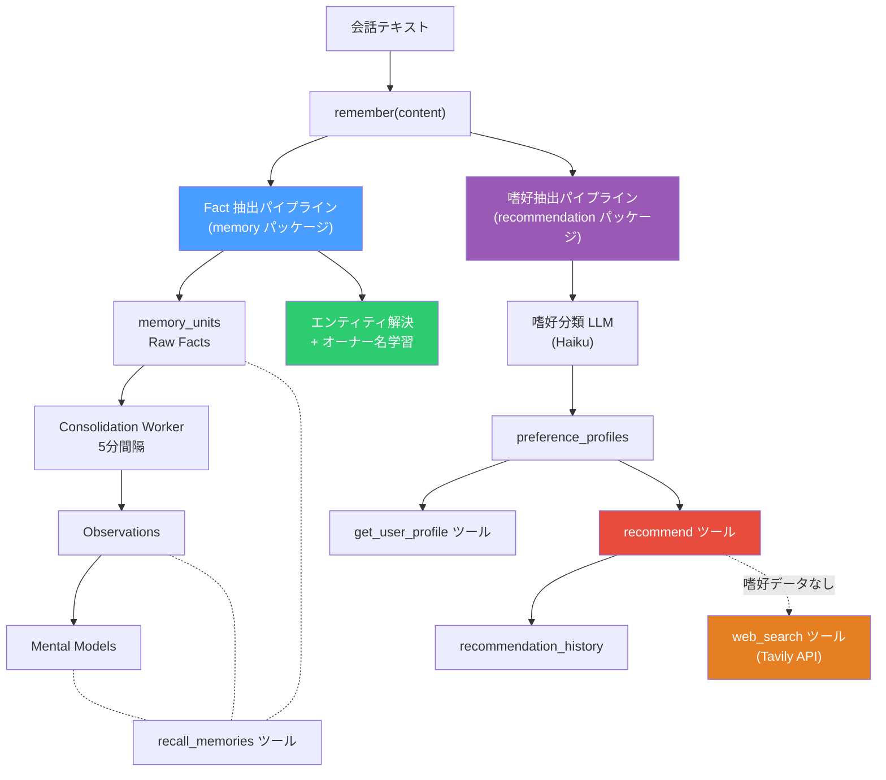
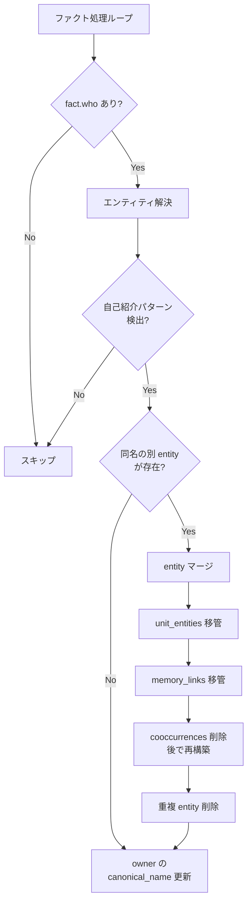
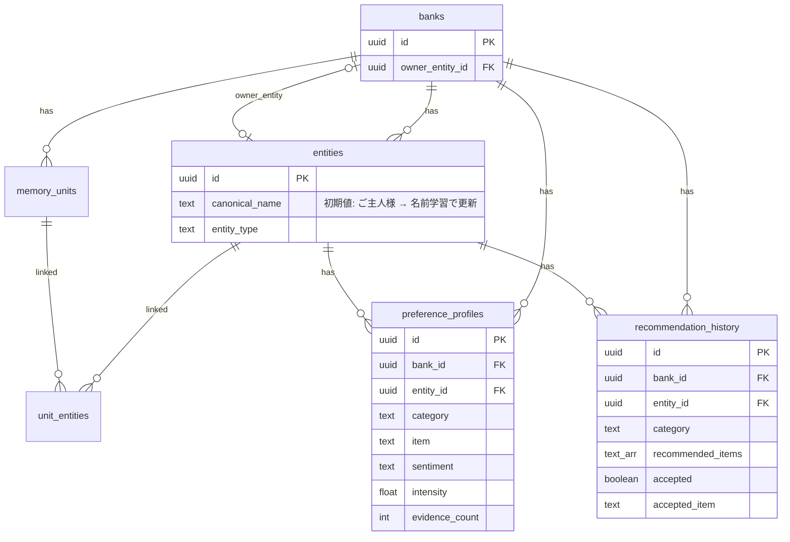

# パーソナライズシステム概要

嗜好抽出・レコメンデーション・オーナー識別の全体像をまとめたドキュメント。

詳細設計:
- [嗜好抽出パイプライン](./README.md)
- [レコメンデーションエンジン](./レコメンデーションエンジン.md)
- [記憶システム](../記憶システム/README.md)

---

## 1. 全体アーキテクチャ



**ポイント**: 2つのパイプラインは `asyncio.gather` で**完全並列**に実行される。一方の失敗が他方に影響しない。

---

## 2. 嗜好プロファイルの構築

### 2.1 データフロー

```
会話テキスト
  → 嗜好分類 LLM (Haiku, temperature=0.0)
  → 構造化 JSON [{category, item, sentiment, intensity}]
  → エンティティ特定 (owner_entity_id)
  → item 名寄せ (pg_trgm similarity)
  → UPSERT preference_profiles
```

### 2.2 嗜好分類

LLM が会話テキストから**明示的な嗜好表現のみ**を抽出する（precision 優先）。

| 抽出する | 抽出しない |
|---------|-----------|
| 「ラーメン好き」「パクチー無理」 | 「ラーメン食べた」（行動報告） |
| 「ジャズにハマってる」 | 「仕事で Python 使ってる」 |

12カテゴリ（food, music, entertainment, hobby, sport, place, work, lifestyle, social, value, fashion, learning）に分類。

### 2.3 item 名寄せ

LLM の出力する item 名のブレを pg_trgm で吸収する。

| ステップ | 閾値 | 例 |
|---------|------|-----|
| クロスカテゴリ名寄せ | 0.8 | 「コーヒー」が food と lifestyle に分散 → 既存カテゴリにマージ |
| 同一カテゴリ内名寄せ | 0.6 | 「味噌ラーメン」→ 既存の「ラーメン」にマージ |

### 2.4 intensity 更新（EMA）

再言及時は指数移動平均で intensity を更新する。

```
new_intensity = old_intensity * 0.7 + extracted_intensity * 0.3
```

`evidence_count` もインクリメントされ、証拠の蓄積量を追跡する。

---

## 3. オーナーエンティティ

### 3.1 自動作成

`retain()` で bank が初めて作成されるとき、owner entity を自動生成して紐づける。

```
Bank 自動作成 (INSERT ... RETURNING id)
  → Entity "ご主人様" 作成 (entity_type='person')
  → banks.owner_entity_id に設定
```

これにより嗜好抽出で `who` が未指定の場合でも `owner_entity_id` をフォールバックとして使用でき、嗜好データが確実に保存される。

### 3.2 名前学習

ユーザーが自己紹介すると、owner entity の `canonical_name` を自動更新する。

**検出パターン**:
- 「私は加藤です」「僕の名前は田中だよ」
- 「名前は佐藤です」
- 「私のこと太郎と呼んで」

**処理フロー**:



**名前マッチングの優先順**:
1. 完全一致: `who` の名前と正規表現キャプチャが完全一致
2. 包含チェック: 2文字以上の共通部分（「加藤太郎」⊃「加藤」）

### 3.3 entity マージ

自己紹介で「加藤」と名乗った場合、エンティティ解決で別途作られた entity「加藤」を owner entity にマージする。

| テーブル | 処理 |
|---------|------|
| `unit_entities` | 参照を owner entity に付け替え |
| `memory_links` | 参照を owner entity に付け替え |
| `entity_cooccurrences` | 削除（`build_links_for_units` で再構築） |
| `entities` | 重複 entity を DELETE |

---

## 4. レコメンデーション

### 4.1 スコア計算

```
score = intensity * 0.5 + evidence_bonus * 0.3 + recency_bonus * 0.2
```

| 要素 | 計算 |
|------|------|
| intensity | 嗜好の強さ (0.0-1.0) |
| evidence_bonus | `min(evidence_count / 10, 1.0)` |
| recency_bonus | 最終言及からの経過日数で減衰 (1週間内=1.0, 1月内=0.7, 3月内=0.4, 他=0.2) |

### 4.2 多様性制御

直近で推薦したアイテムのスコアを減衰させ、同じ提案の繰り返しを防ぐ。

| 直近の推薦時期 | 減衰率 |
|--------------|--------|
| 24時間以内 | x 0.1 |
| 3日以内 | x 0.3 |
| 7日以内 | x 0.6 |
| 7日以上前 | x 1.0 |

### 4.3 回避リスト

`sentiment = 'negative'` のアイテムは推薦候補から除外し、`avoid` リストとしてエージェントに返す。

### 4.4 フィードバックループ

```
recommend → 推薦候補返却 → recommendation_history に記録
  → ユーザーの反応 → accepted / accepted_item を UPDATE
```

Phase 1 ではフィードバック記録のみ。将来的に受入/拒否をスコアに反映予定。

---

## 5. Web 検索連携

嗜好データがないカテゴリや、実在情報が必要な場合のフォールバック。

- **Tavily API** を使用
- **レート制限**: 1会話3回、1日20回、最小間隔10秒
- **インメモリキャッシュ**: 同一クエリ15分間
- エージェント自身が嗜好データと検索結果を組み合わせてフィルタリング

---

## 6. ツール一覧

| ツール | 目的 | データソース |
|--------|------|-------------|
| `recall_memories` | 過去の会話・出来事を思い出す | memory_units, observations, mental_models |
| `get_user_profile` | ユーザーの嗜好を知る | preference_profiles |
| `recommend` | パーソナライズされた提案 | preference_profiles + recommendation_history |
| `record_recommendation_feedback` | 推薦結果へのフィードバック記録 | recommendation_history |
| `web_search` | 実在する最新情報を検索 | Tavily API |

---

## 7. DB テーブル関連図



---

## 8. コスト概要

| コンポーネント | モデル/API | 月間コスト |
|---------------|-----------|-----------|
| Fact 抽出 | Haiku | ~$0.54 |
| Consolidation | Haiku | ~$0.54 |
| Reflect | Haiku | ~$0.54 |
| Embedding | Titan | ~$0.18 |
| 嗜好分類 | Haiku | ~$0.24 |
| Web 検索 | Tavily | ~$0.60 |
| **合計** | | **~$2.64/月** |
