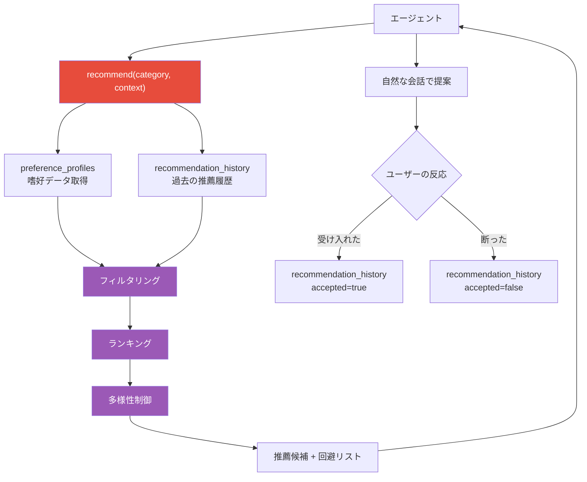
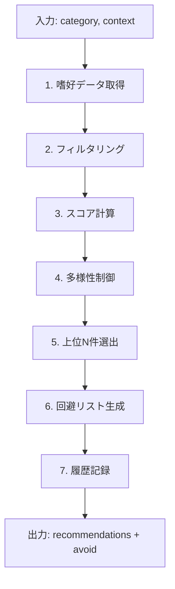
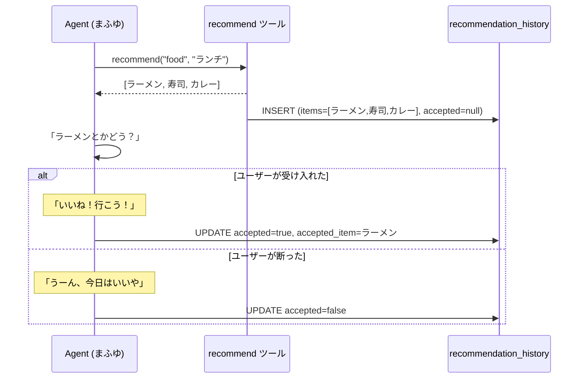
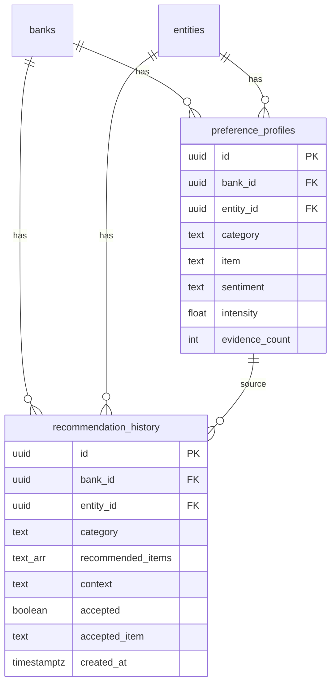
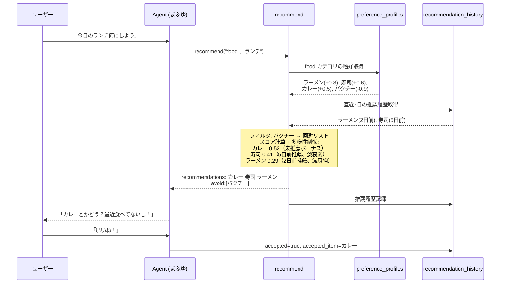
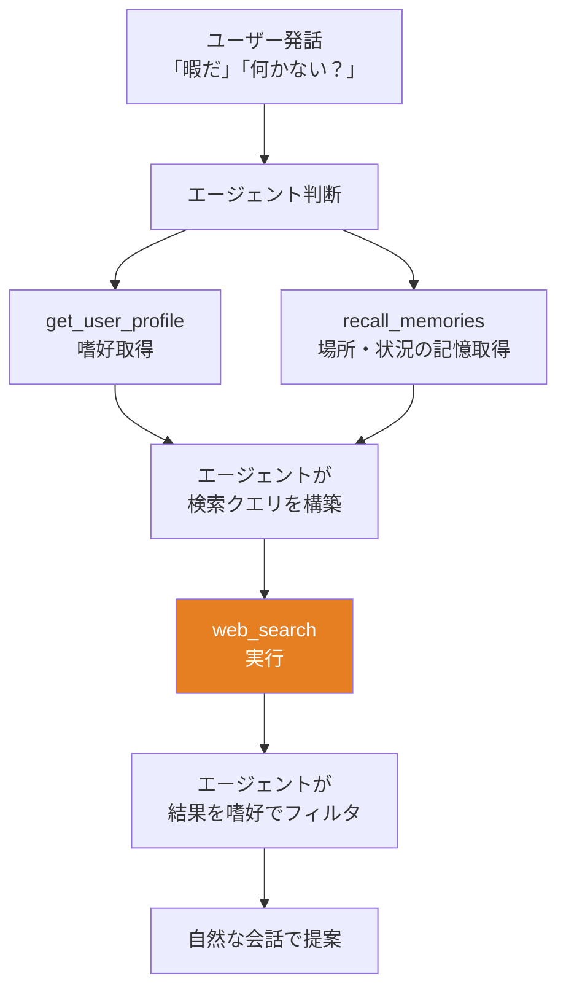
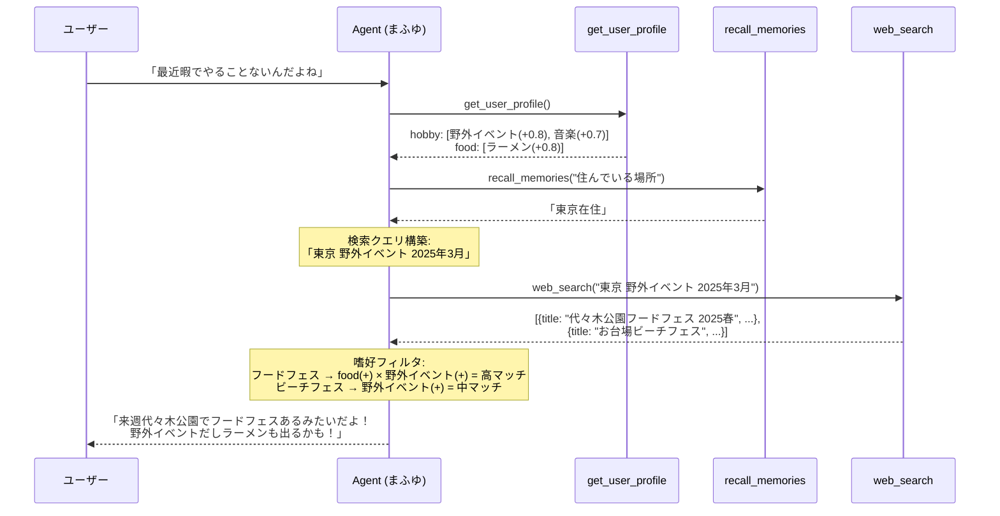

# レコメンデーションエンジン設計

嗜好プロファイル（preference_profiles）を活用し、ユーザーに対してパーソナライズされた提案を行う。

## 1. 概要

### 1.1 前提

- 嗜好データは `preference_profiles` に構造化されて蓄積済み（[README.md](./README.md) 参照）
- エージェント（まふゆ）は会話型キャラクターであり、提案は自然な会話の中で行われる
- レコメンデーションは「ツール呼び出し → 候補取得 → 自然な提案」の流れ

### 1.2 get_user_profile との役割分担

| ツール | 目的 | 出力 |
|--------|------|------|
| `get_user_profile` | ユーザーの嗜好を知る（データ取得） | 嗜好の生データ一覧 |
| `recommend` | ユーザーに何かを提案する（推薦ロジック） | フィルタ・ランキング・多様性を考慮した推薦候補 |

`get_user_profile` は「この人は何が好き？」を知るためのツール。
`recommend` は「この人に何を提案すべき？」を判断するためのツール。

## 2. アーキテクチャ



## 3. recommend ツール

### 3.1 インターフェース

```python
@tool
def recommend(category: str, context: str = "") -> str:
    """ご主人様に何かをおすすめしたいときに使う。
    好みに基づいて、おすすめの候補と避けるべきものを返す。

    Args:
        category: おすすめのカテゴリ（food, entertainment, hobby, sport, place 等）
        context: おすすめの状況や条件（「ランチ」「週末」「疲れている時」等、省略可）
    """
```

### 3.2 レスポンス

```json
{
  "recommendations": [
    {
      "item": "ラーメン",
      "intensity": 0.8,
      "evidence_count": 3,
      "reason": "recent_high_intensity",
      "last_recommended_at": null
    },
    {
      "item": "寿司",
      "intensity": 0.6,
      "evidence_count": 5,
      "reason": "high_evidence",
      "last_recommended_at": "2025-02-20T12:00:00Z"
    }
  ],
  "avoid": [
    {"item": "パクチー", "intensity": 0.9}
  ],
  "context": "food"
}
```

### 3.3 System Prompt ガイド

```
- **recommend**: ご主人様に何かを提案・おすすめしたいときに使う
  - 「何食べよう？」「何かおすすめある？」→ recommend を呼ぶ
  - 結果をそのまま読み上げない。自然な会話として提案する
    ○ 「ラーメンとかどう？最近ハマってたよね！」
    × 「おすすめは1位ラーメン、2位寿司です」
  - avoid リストのアイテムは提案しない
```

## 4. レコメンデーションロジック

### 4.1 処理フロー



### 4.2 Step 1: 嗜好データ取得

```sql
SELECT item, sentiment, intensity, evidence_count,
       first_mentioned_at, last_mentioned_at
FROM preference_profiles
WHERE bank_id = $1
  AND entity_id = $2
  AND category = $3;
```

### 4.3 Step 2: フィルタリング

| 条件 | 処理 |
|------|------|
| `sentiment = 'negative'` | 推薦候補から除外 → 回避リストへ |
| `sentiment = 'neutral'` | 推薦候補に含める（低スコア） |
| `sentiment = 'positive'` | 推薦候補に含める |

### 4.4 Step 3: スコア計算

各候補に推薦スコアを計算する。

```
score = intensity × 0.5
      + evidence_bonus × 0.3
      + recency_bonus × 0.2
```

| 要素 | 計算 | 説明 |
|------|------|------|
| `intensity` | そのまま使用 (0.0-1.0) | 嗜好の強さ |
| `evidence_bonus` | `min(evidence_count / 10, 1.0)` | 証拠が多いほど信頼性が高い。10件で上限 |
| `recency_bonus` | 最終言及からの経過日数に応じて減衰 | 最近言及された嗜好を優先 |

#### recency_bonus の計算

```python
def _recency_bonus(last_mentioned_at: datetime) -> float:
    days_ago = (now() - last_mentioned_at).days
    if days_ago <= 7:
        return 1.0    # 1週間以内
    elif days_ago <= 30:
        return 0.7    # 1ヶ月以内
    elif days_ago <= 90:
        return 0.4    # 3ヶ月以内
    else:
        return 0.2    # それ以上
```

### 4.5 Step 4: 多様性制御

直近で推薦したアイテムのスコアを減衰させ、同じ提案の繰り返しを防ぐ。

```sql
SELECT recommended_item, MAX(created_at) AS last_recommended_at
FROM recommendation_history
WHERE bank_id = $1
  AND entity_id = $2
  AND category = $3
  AND created_at > NOW() - INTERVAL '7 days'
GROUP BY recommended_item;
```

| 直近の推薦時期 | スコア減衰率 |
|--------------|------------|
| 24時間以内 | × 0.1 |
| 3日以内 | × 0.3 |
| 7日以内 | × 0.6 |
| 7日以上前 or 未推薦 | × 1.0（減衰なし） |

### 4.6 Step 5: 上位N件選出

スコア降順で上位3件を返す。最低1件は必ず返す（全て低スコアでも最良の候補を返す）。

### 4.7 Step 6: 回避リスト生成

`sentiment = 'negative'` のアイテムを回避リストとして返す。エージェントはこのリストのアイテムを提案しない。

### 4.8 Step 7: 履歴記録

推薦結果を `recommendation_history` に記録する。

```sql
INSERT INTO recommendation_history
    (bank_id, entity_id, category, recommended_items, context)
VALUES ($1, $2, $3, $4, $5);
```

## 5. フィードバックループ

ユーザーの反応を記録し、将来の推薦品質を向上させる。



### 5.1 フィードバックの活用（将来）

| フィードバック | 活用方法 |
|--------------|---------|
| 頻繁に受け入れられるアイテム | スコアにボーナスを加算 |
| 頻繁に断られるアイテム | スコアにペナルティを適用 |
| 受け入れ率が低いカテゴリ | 推薦頻度を下げる |

Phase 1 ではフィードバック記録のみ実施し、活用は Phase 2 以降で実装する。

## 6. DB スキーマ

### 6.1 recommendation_history テーブル

```sql
-- 005_personalization.sql に追加

CREATE TABLE recommendation_history (
    id UUID PRIMARY KEY DEFAULT gen_random_uuid(),
    bank_id UUID NOT NULL REFERENCES banks(id) ON DELETE CASCADE,
    entity_id UUID NOT NULL REFERENCES entities(id) ON DELETE CASCADE,

    -- 推薦内容
    category TEXT NOT NULL,
    recommended_items TEXT[] NOT NULL,
    context TEXT,

    -- フィードバック
    accepted BOOLEAN,
    accepted_item TEXT,

    created_at TIMESTAMPTZ NOT NULL DEFAULT NOW()
);

-- インデックス
CREATE INDEX idx_rec_history_bank_entity_category
    ON recommendation_history(bank_id, entity_id, category);

CREATE INDEX idx_rec_history_recent
    ON recommendation_history(bank_id, entity_id, created_at DESC);
```

### 6.2 ER 図（レコメンデーション追加）



## 7. データフロー全体像



## 8. モジュール構成

```
recommendation/src/recommendation/
  recommendation.py        # 新規: レコメンデーションロジック
  web_search.py            # 新規: Web 検索クライアント + レート制限 + キャッシュ
  preference_extractor.py  # 既存: 嗜好抽出（08 で作成済み）
  preference_query.py      # 既存: 嗜好クエリ（08 で作成済み）

agentcore/
  core.py                  # 拡張: recommend, web_search ツール追加

postgresql/init/
  005_personalization.sql   # 拡張: recommendation_history テーブル追加
```

| モジュール | 責務 |
|-----------|------|
| `recommendation.py` | 嗜好取得 → フィルタ → スコア計算 → 多様性制御 → 上位選出 → 履歴記録 |
| `web_search.py` | Tavily API クライアント、レート制限、インメモリキャッシュ |
| `core.py` (既存) | `recommend`, `web_search` ツール定義 |

## 9. 実装フェーズ

### Phase 1: 基本レコメンデーション

| タスク | 対象 |
|--------|------|
| recommendation_history テーブル作成 | `005_personalization.sql` |
| レコメンデーションロジック | `recommendation/recommendation.py` |
| recommend ツール | `core.py` |
| System Prompt にガイド追記 | `core.py` |

### Phase 2: フィードバック活用

| タスク | 対象 |
|--------|------|
| フィードバック記録 API | `recommendation/recommendation.py` |
| accepted/rejected をスコアに反映 | `recommendation/recommendation.py` |
| recommend ツールにフィードバック送信機能追加 | `core.py` |

### Phase 3: 外部検索連携

| タスク | 対象 |
|--------|------|
| web_search ツール実装 | `agentcore/core.py`, `recommendation/web_search.py` |
| System Prompt にフロー指示追記 | `agentcore/core.py` |
| 検索結果キャッシュ | `recommendation/web_search.py` |

### Phase 4: 高度なレコメンデーション

| タスク | 概要 |
|--------|------|
| クロスカテゴリ推薦 | 複数カテゴリの嗜好を組み合わせた提案（例: food × place → レストラン提案） |
| 時間帯考慮 | 朝/昼/夜で推薦内容を変える |
| 発見型推薦 | 既存嗜好から未知のアイテムを推測して提案（LLM 推論を活用） |

## 10. 外部検索連携

嗜好データ × Web 検索で、実在するイベント・店舗・コンテンツをユーザーに提案する。

### 10.1 ユースケース

```
ユーザー: 「最近暇でやることないんだよね」

エージェントの思考:
  1. get_user_profile() → 野外イベント(positive), 音楽(positive), 場所:東京(positive)
  2. recall_memories("住んでいる場所") → 「東京在住」
  3. web_search("東京 野外イベント 2025年3月") → 検索結果
  4. 嗜好に合う結果を選んで提案

エージェント: 「来週代々木公園でフードフェスやるみたいだよ！野外イベント好きでしょ？」
```

### 10.2 アーキテクチャ

エージェント自身がツールを組み合わせてフローを制御する。専用の「検索推薦エンジン」は作らない。



**ポイント**: 検索クエリの構築・結果のフィルタリングはエージェント（LLM）自身が行う。専用のフィルタリングロジックは不要。LLM は嗜好データと検索結果を組み合わせて最適な提案を選ぶことが得意。

### 10.3 web_search ツール

```python
@tool
def web_search(query: str) -> str:
    """インターネットで最新情報を検索する。
    イベント、ニュース、お店の情報などを調べたいときに使う。

    Args:
        query: 検索クエリ（日本語）
    """
```

#### レスポンス

```json
{
  "results": [
    {
      "title": "代々木公園フードフェス 2025春",
      "snippet": "3月15日〜16日、代々木公園で全国のグルメが集結...",
      "url": "https://example.com/event/food-fes",
      "date": "2025-03-10"
    },
    {
      "title": "東京近郊おすすめ野外イベント10選",
      "snippet": "2025年春に開催される注目の野外イベントを紹介...",
      "url": "https://example.com/outdoor-events",
      "date": "2025-03-05"
    }
  ],
  "query": "東京 野外イベント 2025年3月"
}
```

#### 実装方式

| 方式 | コスト | 品質 | 備考 |
|------|--------|------|------|
| Google Custom Search API | $5/1000クエリ | 高 | 1日100クエリ無料枠あり |
| Bing Web Search API | $3/1000クエリ | 高 | |
| SerpAPI | $50/月〜 | 高 | Google/Bing のラッパー |
| Tavily API | $0.004/クエリ | 中〜高 | AI エージェント向け。構造化結果 |

推奨: **Tavily API** — AI エージェント向けに設計されており、検索結果が構造化されている。Strands Agent との統合も容易。

### 10.4 エージェントの検索フロー

System Prompt に以下のガイドを追加する。

```
- **web_search**: イベント、お店、ニュースなど最新情報を調べるときに使う
  - 使う前に get_user_profile や recall_memories でご主人様の好みや場所を確認する
  - 検索クエリには具体的な地名・時期・キーワードを含める
    ○ 「東京 野外 音楽イベント 2025年3月」
    × 「イベント」（広すぎる）
  - 検索結果をそのまま列挙しない。ご主人様の好みに合うものを1〜2件選んで自然に紹介する
    ○ 「来週代々木公園でフードフェスやるみたいだよ！」
    × 「検索結果は以下の通りです: 1. ... 2. ... 3. ...」
```

### 10.5 データフロー例



### 10.6 レート制限

Web 検索の乱用を防ぐ。

| 制限 | 値 |
|------|-----|
| 1会話あたりの最大検索回数 | 3回 |
| 1日あたりの最大検索回数（bank単位） | 20回 |
| 最小検索間隔 | 10秒 |

```python
class SearchRateLimiter:
    """検索のレート制限を管理する"""

    MAX_PER_SESSION = 3
    MAX_PER_DAY = 20
    MIN_INTERVAL_SECONDS = 10
```

レート制限に達した場合:

```json
{
  "error": "検索回数の上限に達しました",
  "remaining_today": 0
}
```

### 10.7 検索結果キャッシュ

同一クエリの重複検索を防ぐ。

```python
_search_cache: dict[str, tuple[list[dict], float]] = {}
CACHE_TTL_SECONDS = 900  # 15分

def _get_cached_results(query: str) -> list[dict] | None:
    """キャッシュからの結果取得。TTL 超過分は自動削除。"""
```

インメモリキャッシュで十分。DB に永続化する必要はない。

### 10.8 コスト見積もり

Tavily API ($0.004/クエリ) を想定。

| 項目 | 値 |
|------|-----|
| 1日あたりの平均検索回数 | 5回 |
| 月間検索回数 | ~150回 |
| **月間コスト** | **~$0.60（90円）** |

## 11. 制約と注意事項

### 11.1 推薦頻度の制限

エージェントが推薦を乱発しないよう、System Prompt で制御する。

```
- recommend は、ご主人様が提案を求めたとき、または自然な流れで提案できるときにのみ使う
- 毎ターン recommend を呼ぶ必要はない
- 推薦が断られた場合、同じカテゴリでの再推薦は控える
```

### 11.2 嗜好データが少ない場合

preference_profiles のレコードが 0 件のカテゴリで recommend が呼ばれた場合:

```json
{
  "recommendations": [],
  "avoid": [],
  "context": "food",
  "message": "まだ好みがわかっていないカテゴリです"
}
```

エージェントは「まだ何が好きかよくわかってないんだけど、何か好きなものある？」のように自然に聞く。

### 11.3 コスト総括

| コンポーネント | 月間コスト | 備考 |
|---------------|-----------|------|
| 嗜好抽出 LLM (Haiku) | ~$0.24 | remember 時 |
| レコメンデーションロジック | $0 | SQL + Python |
| Web 検索 (Tavily) | ~$0.60 | 1日5回想定 |
| **追加コスト合計** | **~$0.84** | 既存システム($6/月)に対して約14%増 |
