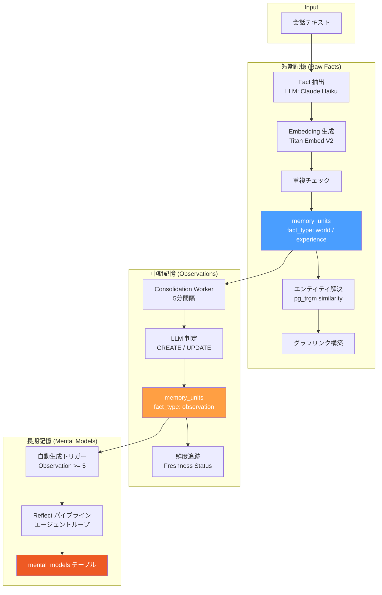
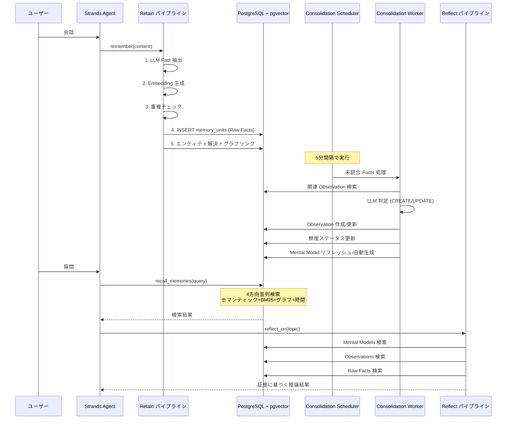
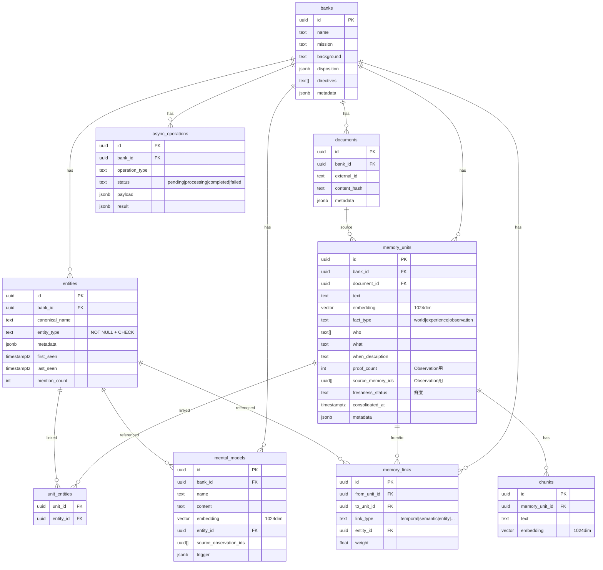

# 記憶システム

Hindsight 論文に基づく3段階記憶モデル。会話から抽出した事実を短期・中期・長期の3階層で管理し、段階的に抽象化・統合していく。

https://arxiv.org/pdf/2512.12818

## アーキテクチャ概要



## 3段階の記憶階層

| 階層 | 名称 | fact_type | 内容 | 生成タイミング |
|------|------|-----------|------|----------------|
| 短期 | Raw Facts | `world` / `experience` | 会話から抽出した5W1H事実 | Retain 実行時（即座） |
| 中期 | Observations | `observation` | Raw Facts のパターン統合・矛盾解消 | Consolidation Worker（5分間隔） |
| 長期 | Mental Models | - | キュレーション済みサマリ | Consolidation 後の自動生成 + Reflect |

## データフロー全体像



## テクノロジースタック

| コンポーネント | 技術 |
|----------------|------|
| AI フレームワーク | Strands Agent (Python) |
| LLM (Fact 抽出/Consolidation) | AWS Bedrock - Claude Haiku 4.5 |
| LLM (Reflect) | AWS Bedrock - Claude Haiku（環境変数で変更可能） |
| Embedding | AWS Bedrock - Titan Embed V2 (1024次元) |
| リランキング | AWS Bedrock - Rerank API |
| データベース | PostgreSQL + pgvector + pg_trgm |
| 非同期処理 | asyncio + asyncpg |

## 主要モジュール構成

```
memory/src/memory/
  engine.py          # MemoryEngine: 公開 API (retain/recall/reflect)
  retain.py          # Retain パイプライン
  recall.py          # Recall パイプライン (4方向検索)
  reflect.py         # Reflect パイプライン (エージェントループ)
  extraction.py      # LLM Fact 抽出
  embedding.py       # Embedding 生成 (Titan Embed V2)
  entity.py          # エンティティ解決 (3要素スコアリング)
  graph.py           # グラフリンク構築
  graph_search.py    # MPFP グラフ検索
  temporal_search.py # 時間範囲検索
  reranker.py        # クロスエンコーダリランキング
  freshness.py       # 鮮度追跡
  mental_model.py    # Mental Model CRUD
  visibility.py      # タグベース可視性制御
  disposition.py     # 性格特性プロンプト
  directive.py       # ディレクティブ管理
  bedrock_client.py  # Bedrock クライアント共有
  db.py              # DB 接続プール管理
```

## DB スキーマ概要



## 関連ドキュメント

- [短期記憶 (Raw Facts)](./短期記憶.md)
- [中期記憶 (Observations)](./中期記憶.md)
- [長期記憶 (Mental Models)](./長期記憶.md)
