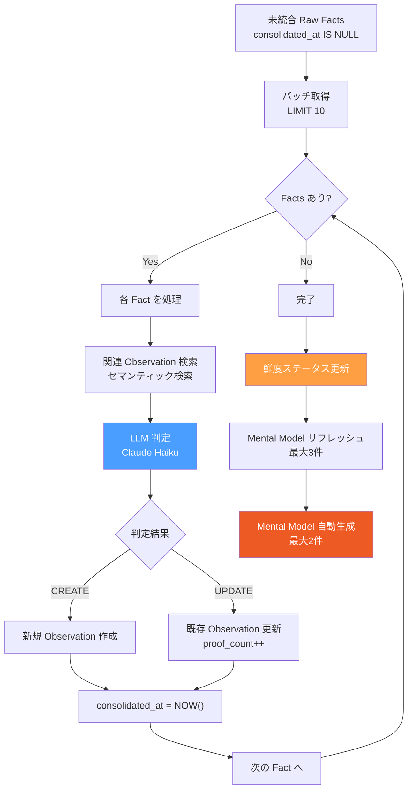
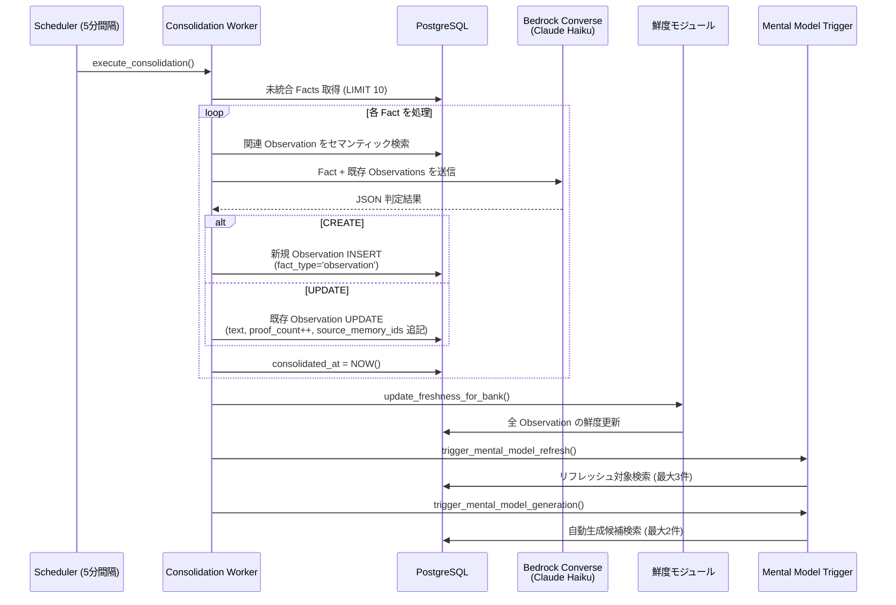
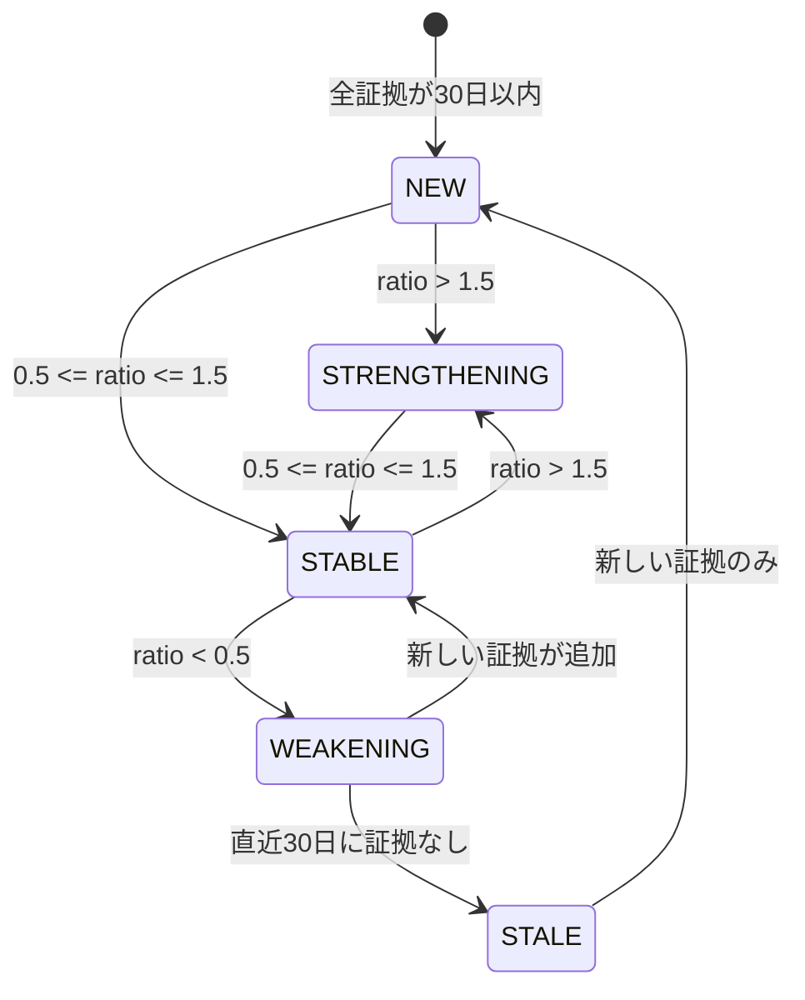
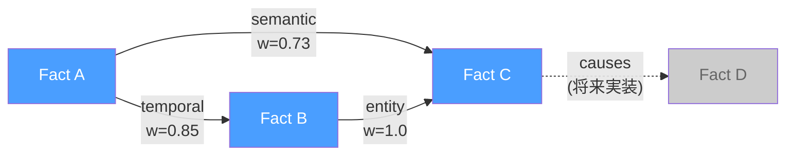

# 中期記憶 (Observations)

Raw Facts を自動統合してパターンを検出し、耐久性のある知識（Observations）に昇華する。鮮度追跡により知識の信頼度を動的に管理する。

## 概要

- **fact_type**: `observation`
- **生成タイミング**: Consolidation Worker が5分間隔で自動実行
- **格納先**: `memory_units` テーブル（`fact_type = 'observation'`）
- **特有フィールド**: `proof_count`, `source_memory_ids`, `history`, `confidence_score`, `freshness_status`

## Consolidation Worker



### 処理フロー詳細



### LLM 判定

LLM に新しいファクトと既存 Observations を提示し、以下の判定を行わせる:

| 判定 | 説明 | 処理 |
|------|------|------|
| `CREATE` | 新しいトピックの知識 | 新規 Observation を作成 |
| `UPDATE` | 既存 Observation の補強・更新 | テキスト更新 + `proof_count` 増加 |

**重要な制約:**
- 異なる人物の事実をマージしない
- 無関係なトピックをマージしない
- 矛盾は両方の状態を時間マーカーで示す（`used to X, now Y` パターン）
- 1つの Observation は1人の特定トピックに焦点を当てる

### Observation の特有フィールド

| フィールド | 型 | 説明 |
|-----------|-----|------|
| `proof_count` | INTEGER | この Observation を裏付ける証拠（Raw Facts）の数 |
| `source_memory_ids` | UUID[] | 根拠となった Raw Facts の ID 配列 |
| `history` | JSONB | 変更履歴（矛盾解消時の以前の状態を記録） |
| `confidence_score` | FLOAT | 信頼度スコア (0.0 - 1.0) |
| `freshness_status` | TEXT | 鮮度ステータス |

## 鮮度追跡 (Freshness Tracking)

Observation の鮮度を証拠のタイムスタンプ分布から自動計算する。Consolidation 完了後に一括実行。

### 計算式

```
recent_density = 直近30日の証拠数 / 30
older_density  = それ以前の証拠数 / (総期間 - 30)
ratio = recent_density / older_density
```

### ステータス判定



| ステータス | 条件 | 意味 |
|-----------|------|------|
| `new` | 全証拠が30日以内 | 新しく形成された知識 |
| `strengthening` | ratio > 1.5 | 最近の証拠が増加傾向 |
| `stable` | 0.5 <= ratio <= 1.5 | 安定した知識 |
| `weakening` | ratio < 0.5 | 最近の証拠が減少傾向 |
| `stale` | 直近30日に証拠なし | 古くなった知識 |

## グラフ構造

Raw Facts 間のグラフエッジを自動構築し、記憶の関連性をモデリングする。

### リンク種別



| リンク種別 | 説明 | 重み |
|-----------|------|------|
| `temporal` | 24時間以内に発生した事実 | 時間差に反比例 (min 0.3) |
| `semantic` | 意味的に類似した事実 (Top-5) | コサイン類似度 (>= 0.7) |
| `entity` | 同一エンティティを共有 | 固定 1.0 |
| `causes` / `caused_by` | 因果関係 | 将来実装（LLM 抽出が必要） |

### MPFP グラフ検索

Recall パイプラインでは Multi-Path Fluid Propagation (MPFP) アルゴリズムでグラフを探索する。

- セマンティック検索結果の上位5件（cosine >= 0.5）をシードノードに
- グラフエッジを辿って関連する記憶を発見
- リンクの `weight` でスコアを伝搬

### 共起テーブル

`entity_cooccurrences` テーブルでエンティティ間の共起頻度をキャッシュする。

```sql
-- entity_id_1 < entity_id_2 の制約で方向を正規化
CREATE TABLE entity_cooccurrences (
    entity_id_1 UUID NOT NULL,
    entity_id_2 UUID NOT NULL,
    bank_id UUID NOT NULL,
    cooccurrence_count INTEGER DEFAULT 1,
    last_cooccurred TIMESTAMPTZ,
    CHECK (entity_id_1 < entity_id_2)
);
```

## DB スキーマ

### memory_links テーブル

```sql
CREATE TABLE memory_links (
    id UUID PRIMARY KEY,
    bank_id UUID NOT NULL REFERENCES banks(id),
    from_unit_id UUID NOT NULL REFERENCES memory_units(id),
    to_unit_id UUID NOT NULL REFERENCES memory_units(id),
    link_type TEXT NOT NULL CHECK (link_type IN (
        'temporal', 'semantic', 'entity', 'causes', 'caused_by'
    )),
    entity_id UUID REFERENCES entities(id),
    weight FLOAT NOT NULL DEFAULT 1.0,
    created_at TIMESTAMPTZ
);

-- リンク重複防止（COALESCE で NULL entity_id をセンチネル UUID に変換）
CREATE UNIQUE INDEX idx_memory_links_unique_coalesce
    ON memory_links (
        from_unit_id, to_unit_id, link_type,
        COALESCE(entity_id, '00000000-0000-0000-0000-000000000000'::uuid)
    );
```

### インデックス

| インデックス | 種別 | 用途 |
|-------------|------|------|
| `idx_memory_units_embedding_observation` | HNSW (partial) | Observation 専用セマンティック検索 |
| `idx_memory_links_traversal` | B-tree | グラフ順方向トラバーサル |
| `idx_memory_links_weighted` | B-tree (partial) | weight >= 0.1 のリンク検索 |
| `idx_memory_links_reverse` | B-tree | グラフ逆方向トラバーサル |
| `idx_memory_units_tags` | GIN | タグフィルタリング |
| `idx_memory_units_occurred` | B-tree (partial) | 時間範囲検索 |
