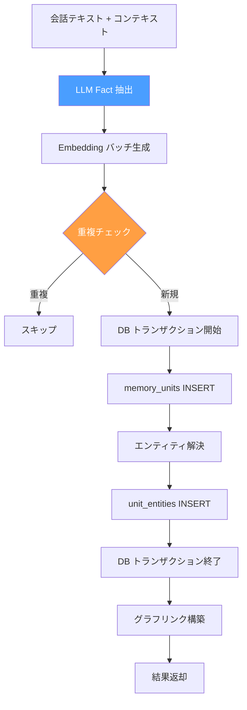
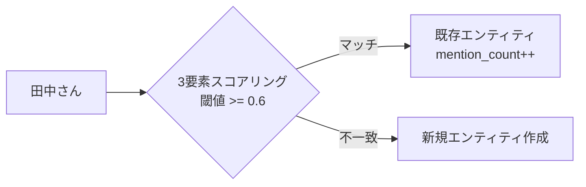
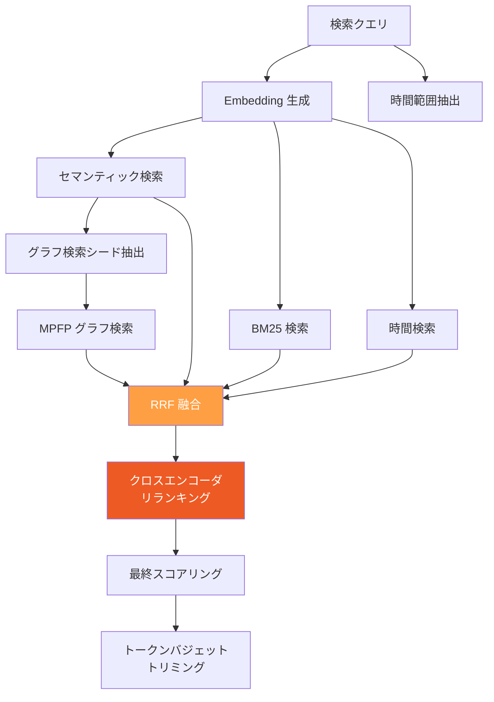

# 短期記憶 (Raw Facts)

会話テキストから5W1H構造の事実（Raw Facts）を抽出し、Embedding 付きで永続化する。記憶システムの入力層。

## 概要

- **fact_type**: `world`（客観的事実）/ `experience`（主観的体験）
- **生成タイミング**: ユーザーとの会話後に `remember` ツールで即座に実行
- **格納先**: `memory_units` テーブル
- **Embedding**: Titan Embed V2 (1024次元)

## Retain パイプライン



### 1. LLM Fact 抽出

Bedrock Converse API (Claude Haiku 4.5) で会話テキストから構造化されたファクトを抽出する。

**抽出されるフィールド:**

| フィールド | 説明 | 例 |
|-----------|------|-----|
| `text` | ファクトの要約テキスト | "田中さんは東京でエンジニアとして働いている" |
| `what` | 何が起きたか | "エンジニアとして東京で勤務" |
| `who` | 関係する人物 | `["田中太郎"]` |
| `when_description` | いつ起きたか | "2024年から" |
| `where_description` | どこで起きたか | "東京" |
| `why_description` | なぜ重要か | "職業に関する基本情報" |
| `event_date` | 日時 (UTC) | `2024-01-15T00:00:00Z` |
| `fact_kind` | 種別 | `event` / `conversation` |
| `fact_type` | 分類 | `world` / `experience` |

### 2. Embedding 生成

各ファクトのテキストを Titan Embed V2 で 1024次元ベクトルに変換する。

- 日時情報がある場合はテキストに付加: `"text (happened on 2024-01-15)"`
- 並列数制限: セマフォ 5
- バッチ処理で複数ファクトを一括変換

### 3. 重複チェック

同一内容の二重登録を防止する。

| fact_kind | チェック方法 |
|-----------|-------------|
| `event` | 12時間バケット + コサイン類似度 >= 0.9 |
| `conversation` | コサイン類似度 >= 0.9（時間制約なし） |

### 4. エンティティ解決

`who` フィールドの人名を正規化エンティティにマッピングする。3要素スコアリングで既存エンティティとの照合を行う。



**スコアリング要素:**

| 要素 | 重み | 手法 |
|------|------|------|
| 名前類似度 | 0.5 | `SequenceMatcher` ratio |
| 共起エンティティ | 0.3 | 同一ファクト内の他エンティティとの共起頻度 |
| 時間的近接性 | 0.2 | 7日ウィンドウ内の活動 |

- 合計スコアが閾値 0.6 以上で既存エンティティにマッチ
- マッチしなければ新規作成
- `unit_entities` 中間テーブルで memory_unit とリンク
- バッチ処理によりエンティティ数に依存しない定数回のDBクエリで動作

### 5. グラフリンク構築

保存されたファクト間に自動でグラフエッジを作成する。

| リンク種別 | 条件 | 重み計算 |
|-----------|------|----------|
| `temporal` | 24時間以内の他ファクト | 時間差に反比例（min: 0.3） |
| `semantic` | コサイン類似度 Top-5 (>= 0.7) | 類似度そのまま |
| `entity` | 同一エンティティを共有 | 固定 1.0 |

`entity_cooccurrences` テーブルも同時に更新し、エンティティ間の共起頻度をキャッシュする。

## Recall パイプライン

4方向並列検索で記憶を想起する。



### 4方向検索の詳細

#### セマンティック検索
- pgvector の HNSW インデックスを利用
- `PARTITION BY fact_type` でバランスされた検索（各タイプ最大34件）
- 類似度閾値: 0.1

#### BM25 全文検索 (pg_trgm)
- 日本語の助詞ベースでキーワードを分割
- 複合助詞（`について`、`に関して` 等）を除去
- `ILIKE` + `similarity()` でスコアリング

#### 時間検索
- クエリから日本語の時間表現を正規表現で抽出
- 対応表現: `昨日`、`先週`、`3日前`、`2024年6月`、`先週の月曜日` 等
- `occurred_start` / `occurred_end` / `mentioned_at` で範囲マッチ

#### グラフ検索 (MPFP)
- セマンティック結果の上位5件（cosine >= 0.5）をシードノードに
- Multi-Path Fluid Propagation でグラフトラバーサル

### RRF 融合

4方向の検索結果を Reciprocal Rank Fusion で統合する。

```
score(d) = Σ 1/(K + rank_in_list_i)    K=60
```

### 最終スコアリング

```
final_score = 0.5 * CE_score + 0.3 * RRF_norm + 0.1 * recency + 0.1 * temporal_proximity
```

| 重み | シグナル | 説明 |
|------|---------|------|
| 0.5 | CE (Cross-Encoder) | Bedrock Rerank API によるリランキングスコア |
| 0.3 | RRF (正規化) | RRF 融合スコアの正規化値 |
| 0.1 | Recency | 新しい記憶ほど高スコア（365日で減衰） |
| 0.1 | Temporal Proximity | 検索時間範囲の中央に近いほど高スコア |

### トークンバジェット

| バジェット | max_tokens | max_results |
|-----------|------------|-------------|
| `low` | 2,048 | 20 |
| `mid` | 4,096 | 50 |
| `high` | 8,192 | 100 |

## DB スキーマ

### memory_units テーブル（短期記憶部分）

```sql
CREATE TABLE memory_units (
    id UUID PRIMARY KEY,
    bank_id UUID NOT NULL REFERENCES banks(id),
    document_id UUID REFERENCES documents(id),
    text TEXT NOT NULL,
    context TEXT,
    embedding vector(1024),

    fact_type TEXT NOT NULL CHECK (fact_type IN ('world', 'experience', 'observation')),
    fact_kind TEXT CHECK (fact_kind IN ('event', 'conversation')),

    -- 5W1H
    what TEXT,
    who TEXT[],
    when_description TEXT,
    where_description TEXT,
    why_description TEXT,

    -- 時間メタデータ
    event_date TIMESTAMPTZ,
    occurred_start TIMESTAMPTZ,
    occurred_end TIMESTAMPTZ,
    mentioned_at TIMESTAMPTZ,

    -- Observation-specific
    proof_count INTEGER DEFAULT 0,
    source_memory_ids UUID[],
    history JSONB DEFAULT '[]',
    confidence_score FLOAT DEFAULT 1.0,

    -- Consolidation
    consolidated_at TIMESTAMPTZ,  -- NULL = 未統合

    tags TEXT[] DEFAULT '{}',
    metadata JSONB DEFAULT '{}',
    created_at TIMESTAMPTZ,
    updated_at TIMESTAMPTZ
);
```

### インデックス

| インデックス | 種別 | 用途 |
|-------------|------|------|
| `idx_memory_units_embedding` | HNSW | セマンティック検索（全タイプ） |
| `idx_memory_units_embedding_world` | HNSW (partial) | world 専用セマンティック検索 |
| `idx_memory_units_embedding_experience` | HNSW (partial) | experience 専用セマンティック検索 |
| `idx_memory_units_text_trgm` | GIN (pg_trgm) | テキスト全文検索 |
| `idx_memory_units_context_trgm` | GIN (pg_trgm) | コンテキスト全文検索 |
| `idx_memory_units_bank_type_date` | B-tree | bank + type + date の複合検索 |
| `idx_memory_units_unconsolidated` | B-tree (partial) | Consolidation Worker 用 |
