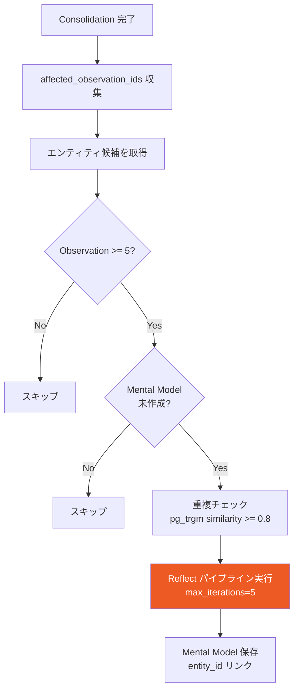
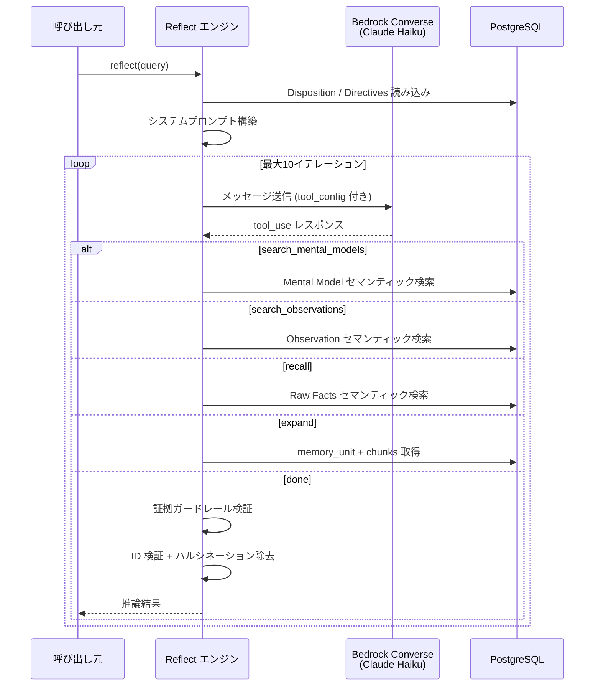
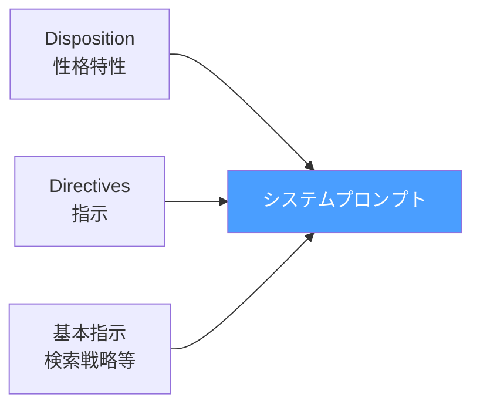

# 長期記憶 (Mental Models)

Observations を深い推論で統合し、最高信頼度のキュレーション済みサマリを生成する。Reflect パイプラインによるエージェントループで証拠に基づいた知識を構築する。

## 概要

- **格納先**: `mental_models` テーブル
- **生成方法**: Consolidation 後の自動生成 + 手動 Reflect
- **LLM**: Claude Haiku（環境変数 `REFLECT_MODEL_ID` で変更可能）
- **エンティティ単位**: 1つの Mental Model は1つのエンティティに紐付く

## 自動生成フロー

Consolidation 完了後、条件を満たすエンティティの Mental Model を自動生成する。



### 生成条件

| 条件 | 値 |
|------|-----|
| 最小 Observation 数 | 5 |
| 1回の Consolidation あたりの最大生成数 | 2 |
| 1回の Consolidation あたりの最大リフレッシュ数 | 3 |
| Reflect max_iterations | 5（軽量化。手動 Reflect は10） |
| 重複判定 similarity 閾値 | 0.8 |
| 最小 content 長 | 50 文字 |

### 重複防止

3層の防御で重複を防止する:

1. **SQL レベル**: `_find_generation_candidates` で `entity_id` による LEFT JOIN チェック
2. **アプリレベル**: `_check_mental_model_exists` で `entity_id` + `pg_trgm similarity` 二重チェック
3. **DB 制約**: `idx_mental_models_bank_entity` UNIQUE インデックス（最終防御）

## Reflect パイプライン

Bedrock Converse API の `tool_use` を利用した独自エージェントループ。3階層の記憶を階層的に検索し、証拠に基づいた深い推論を行う。



### 5つのツール

Reflect エージェントが利用可能なツール。上位階層から順に検索を進める。

| ツール | 対象 | デフォルト | 上限 | 説明 |
|--------|------|-----------|------|------|
| `search_mental_models` | Mental Models | 5 | 20 | 最上位の統合知識を検索 |
| `search_observations` | Observations | 20 | 50 | 中間レベルの統合パターンを検索 |
| `recall` | Raw Facts | 30 | 100 | 元の事実を検索（observation 除外） |
| `expand` | memory_unit + chunks | - | 10 | 特定記憶の完全テキスト取得 |
| `done` | - | - | - | 推論を確定して結果を返す |

### 証拠ガードレール

`done` ツール呼び出し時に以下を検証する:

1. **証拠の存在**: `memory_ids`, `mental_model_ids`, `observation_ids` のいずれかに有効な ID が必要
2. **ID 検証**: 実在する UUID のみ許可。ハルシネーション ID は自動除去
3. **ディレクティブ遵守**: ディレクティブが設定されている場合、`directive_adherence` フィールドの確認

### システムプロンプト構成



#### Disposition（性格特性）

`banks.disposition` JSONB から読み込む3軸の性格パラメータ:

| 軸 | 範囲 | 低い場合 | 高い場合 |
|----|------|---------|---------|
| `skepticism` | 1-5 | 事実をそのまま受け入れる | 矛盾や欠落を積極的に指摘 |
| `literalism` | 1-5 | 行間を読んで推論する | テキストに忠実に解釈 |
| `empathy` | 1-5 | 客観的・分析的 | 感情を理解し共感的 |

#### Directives（指示）

`banks.directives` TEXT[] から読み込む行動指針。システムプロンプト内にセクションとして挿入される。

### 戻り値

```python
{
    "answer": str,              # 推論結果テキスト
    "memory_ids": list[str],    # 引用した Raw Facts の ID
    "mental_model_ids": list[str],  # 引用した Mental Models の ID
    "observation_ids": list[str],   # 引用した Observations の ID
    "iterations": int,          # 実行イテレーション数
    "tool_calls": list[dict],   # ツール呼び出し履歴
    "elapsed_ms": float,        # 実行時間 (ms)
}
```

## タグベース可視性制御

Mental Models と Observations にはタグを付与でき、検索時にフィルタリングできる。

| モード | 説明 |
|--------|------|
| `any` | いずれかのタグがマッチ（タグなし記憶も含む） |
| `all` | 全タグがマッチ（タグなし記憶も含む） |
| `any_strict` | いずれかのタグがマッチ（タグなし記憶は除外） |
| `all_strict` | 全タグがマッチ（タグなし記憶は除外） |

Mental Model リフレッシュ時はタグ付きモデルに `tags_match="all_strict"` を適用し、情報漏洩を防止する。

## DB スキーマ

### mental_models テーブル

```sql
CREATE TABLE mental_models (
    id UUID PRIMARY KEY,
    bank_id UUID NOT NULL REFERENCES banks(id),
    name TEXT NOT NULL,
    description TEXT,
    content TEXT,                    -- Reflect が生成した推論結果
    source_query TEXT,               -- 生成時のクエリ
    embedding vector(1024),          -- セマンティック検索用
    entity_id UUID REFERENCES entities(id),  -- 紐付くエンティティ
    source_observation_ids UUID[],   -- 根拠となった Observations
    tags TEXT[],
    max_tokens INTEGER DEFAULT 2048,
    trigger JSONB,                   -- {"refresh_after_consolidation": bool}
    last_refreshed_at TIMESTAMPTZ,
    created_at TIMESTAMPTZ,
    updated_at TIMESTAMPTZ
);
```

### chunks テーブル

ソーステキストをチャンク分割して保存する。`expand` ツールで取得。

```sql
CREATE TABLE chunks (
    id UUID PRIMARY KEY,
    bank_id UUID NOT NULL REFERENCES banks(id),
    memory_unit_id UUID NOT NULL REFERENCES memory_units(id),
    chunk_index INTEGER NOT NULL DEFAULT 0,
    text TEXT NOT NULL,
    embedding vector(1024),
    metadata JSONB,
    created_at TIMESTAMPTZ
);
```

### インデックス

| インデックス | 種別 | 用途 |
|-------------|------|------|
| `idx_mental_models_bank` | B-tree | bank 内の Mental Model 検索 |
| `idx_mental_models_embedding` | HNSW (partial) | セマンティック検索 |
| `idx_mental_models_tags` | GIN | タグフィルタリング |
| `idx_mental_models_bank_entity` | UNIQUE (partial) | bank 内の entity_id 重複防止 |
| `idx_chunks_memory_unit` | B-tree | memory_unit 逆引き |
| `idx_chunks_embedding` | HNSW (partial) | チャンクのセマンティック検索 |
